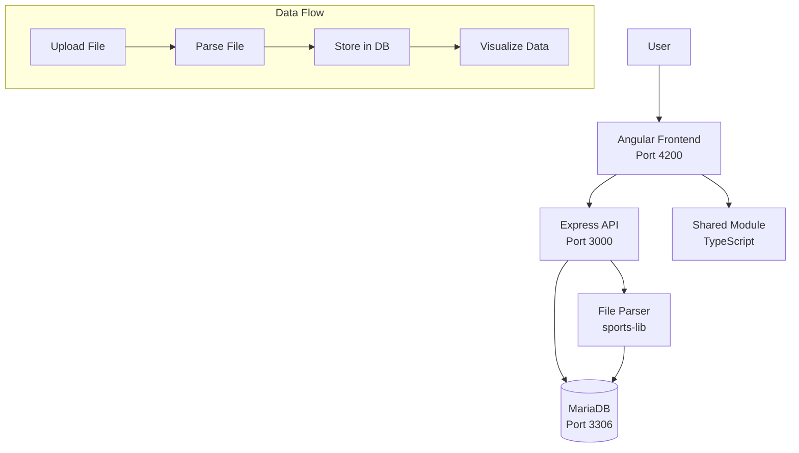

# OpenFitLab – Fitness Activity Tracker

A self-hosted fitness activity tracking and comparison platform. Upload activity files (TCX, FIT, GPX) from your fitness devices, visualize your workouts with interactive graphs, and compare activities side-by-side to analyze performance and compare data from different fitness trackers.

## Features

- **File Upload**: Upload activity files in multiple formats (TCX, FIT, GPX, JSON, SML)
- **Activity Visualization**: View heart rate, cadence, pace, elevation, and other metrics in interactive graphs
- **Activity Comparison**: Compare two or more workouts side-by-side with merged views
- **Stream Analysis**: Analyze relationships between different data streams (correlation, XY plots, correlation indices)
- **Tracker Comparison**: Compare data from different fitness trackers to evaluate device accuracy

## Architecture



### Technology Stack

- **Backend**: Node.js 24, Express.js, MariaDB
- **Frontend**: Angular 20, TypeScript, Angular Material
- **Parsing**: `@sports-alliance/sports-lib` for TCX/FIT/GPX/JSON/SML parsing
- **Deployment**: Docker Compose (self-hosted)

### Database Schema

The application uses a relational database structure:

- **Events**: Top-level workout sessions with metadata
- **Event Stats**: Relational storage for event-level statistics (one row per stat type)
- **Activities**: Individual activities within an event
- **Activity Stats**: Relational storage for activity-level statistics
- **Streams**: Stream metadata (heart rate, cadence, pace, etc.)
- **Stream Data Points**: Timestamped data points for each stream (stored relationally with time_ms)

See [docs/ARCHITECTURE.md](docs/ARCHITECTURE.md) for detailed architecture documentation.

## Prerequisites

- Docker and Docker Compose
- (Optional) Node 22 for frontend, Node 24 for backend if running outside Docker

## Quick Start

From this directory (`refactoring/`):

```bash
docker compose up -d
```

This starts:
- **DB:** MariaDB on `localhost:3306` (user/password/database from `.env` or defaults in `docker-compose.yml`)
- **API:** http://localhost:3000 (GET `/` or `/health` returns `{ "ok": true }`)
- **Frontend:** http://localhost:4200 (Angular dev server)
- **Adminer:** http://localhost:8080 (database admin UI)

## Development Mode

Compose uses base Node images (`node:24-alpine` for the API, `node:22-alpine` for the frontend) and **mounts** `./backend` and `./frontend` into each container. No Dockerfiles are built.

- **Backend:** `./backend` is mounted at `/app`; `node --watch` restarts the server when files under `src/` change.
- **Frontend:** `./frontend` is mounted at `/app`; `ng serve` live-reloads on file changes.

Edit files under `backend/` or `frontend/` on your host and changes are reflected immediately (API restarts, frontend hot-reloads).

## API Documentation

### Events API

- **GET /api/events** – List events
  - Query params: `startDate`, `endDate` (timestamps), `limit` (default 50, max 200)
  - Returns: Array of event objects with `stats` and `payload_rest` merged

- **GET /api/events/:id** – Get single event with activities
  - Returns: `{ event: {...}, activities: [...] }`
  - Event and activities include `stats` objects

- **GET /api/events/:id/activities/:activityId/streams** – Get stream data
  - Query params: `types` (optional, filter by stream types)
  - Returns: Array of `{ type: string, data: [{ time: number, value: any }, ...] }`

- **POST /api/events** – Upload and parse file
  - Content-Type: `multipart/form-data`
  - Body: `files` (one or more files: TCX, FIT, GPX, JSON, SML)
  - Backend parses file, extracts event/activities/streams, stores in database
  - Files are parsed and discarded (not stored)
  - Returns: `{ id: string, event: {...}, activities: [...] }`

- **DELETE /api/events/:id** – Delete event
  - Cascades to delete all related data (stats, streams, activities)
  - Returns: 204 No Content or 404 Not Found

## Shared Module

`refactoring/shared/` is a TypeScript package used by the frontend:

- **api-event-writer** – `uploadFileToApi()` – Uploads raw files to API for backend parsing
- **app-event.interface** – `AppEventInterface`, `OriginalFileMetaData` (extends sports-lib `EventInterface`)

The frontend is wired via TypeScript path mapping: `@openfitlab/shared` → `../shared/src`.

## Production Build

From the **repository root** you can run:

- **Start stack:** `npm run refactor:up` (brings up DB, API, frontend in Docker)
- **Stop stack:** `npm run refactor:down`
- **Production build:** `npm run refactor:build` (builds the refactoring frontend; output in `refactoring/frontend/dist/openfitlab/`)

The refactoring frontend has a production configuration that uses `src/environments/environment.prod.ts` (same `apiUrl: '/api'` for same-origin deployment). Use the built assets with any static host and point `/api` at the Node API.

## Environment

Copy `.env.example` to `.env` and adjust if needed. Defaults:

- `MARIADB_ROOT_PASSWORD=qsroot`
- `MARIADB_DATABASE=openfitlab`
- `MARIADB_USER=qs`, `MARIADB_PASSWORD=qspass`

## Stop

```bash
docker compose down
```

Data in MariaDB is kept in the `db_data` volume. Use `docker compose down -v` to remove volumes.

## Documentation

- **[AGENTS.md](AGENTS.md)** - AI coding agent context and instructions
- **[docs/ARCHITECTURE.md](docs/ARCHITECTURE.md)** - Detailed system architecture
- **[docs/PRD.md](docs/PRD.md)** - Product Requirements Document

## Key Architectural Decisions

- **File parsing on backend**: Files are uploaded raw, parsed server-side, then discarded. No file storage.
- **Relational stats storage**: Statistics stored in separate tables (`event_stats`, `activity_stats`) with one row per stat type.
- **Timestamped stream data**: Stream data stored relationally in `stream_data_points` with `time_ms` (UTC milliseconds).
- **No migrations**: Schema runs on startup. Schema changes require recreating database.
- **Self-hosted deployment**: Docker Compose is the deployment artifact.
