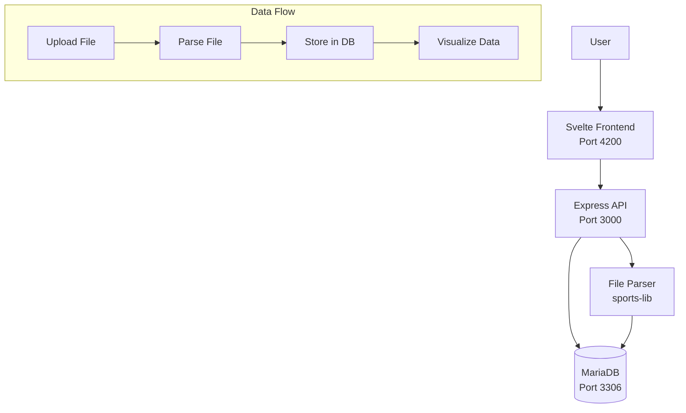

# OpenFitLab – Fitness Activity Tracker

A self-hosted fitness activity tracking and comparison platform. Upload activity files (TCX, FIT, GPX) from your fitness devices, visualize your workouts with interactive graphs, and compare activities side-by-side to analyze performance and compare data from different fitness trackers.

## Features

- **File Upload**: Upload activity files in multiple formats (TCX, FIT, GPX, JSON, SML)
- **Activity Visualization**: View heart rate, cadence, pace, elevation, and other metrics in interactive graphs
- **Activity Comparison**: Compare two or more workouts side-by-side with merged views
- **Stream Analysis**: Analyze relationships between different data streams (correlation, XY plots, correlation indices)
- **Tracker Comparison**: Compare data from different fitness trackers to evaluate device accuracy

## Architecture



### Technology Stack

- **Backend**: Node.js 24, Express.js, MariaDB
- **Frontend**: Svelte 5, Vite, Tailwind CSS v4
- **Parsing**: `@sports-alliance/sports-lib` for TCX/FIT/GPX/JSON/SML parsing
- **Deployment**: Docker Compose (self-hosted)

### Database Schema

The application uses a relational database structure:

- **Events**: Top-level workout sessions with metadata
- **Event Stats**: Relational storage for event-level statistics (one row per stat type)
- **Activities**: Individual activities within an event
- **Activity Stats**: Relational storage for activity-level statistics
- **Streams**: Stream metadata (heart rate, cadence, pace, etc.)
- **Stream Data Points**: Timestamped data points for each stream (stored relationally with time_ms)

See [docs/ARCHITECTURE.md](docs/ARCHITECTURE.md) for detailed architecture documentation.

## Prerequisites

- Docker and Docker Compose
- (Optional) Node 22 for frontend, Node 24 for backend if running outside Docker

## Quick Start

From the project root:

```bash
docker compose up -d
```

This starts:
- **DB:** MariaDB on `localhost:3306` (user/password/database from `.env` or defaults in `docker-compose.yaml`)
- **API:** http://localhost:3000 (GET `/` or `/health` returns `{ "ok": true }`)
- **Frontend:** http://localhost:4200 (Svelte/Vite dev server)
- **Adminer:** http://localhost:8080 (database admin UI)

## Development Mode

Compose uses base Node images (`node:24-alpine` for the API, `node:22-alpine` for the frontend) and **mounts** `./backend` and `./frontend` into each container. No Dockerfiles are built.

- **Backend:** `./backend` is mounted at `/app`; `node --watch` restarts the server when files under `src/` change.
- **Frontend:** `./frontend` is mounted at `/workspace/frontend`; Vite dev server hot-reloads on file changes.

Edit files under `backend/` or `frontend/` on your host and changes are reflected immediately (API restarts, frontend hot-reloads).

## Testing / Quality checks

- **Backend:** From `backend/`: `npm run lint`, `npm run format`, `npm run test:unit`. See [AGENTS.md](AGENTS.md) for full commands.
- **Frontend:** From `frontend/`: `npm run ci` runs format, lint, typecheck, tests, and build.
- **CI:** Push and pull requests to `main` run backend checks when backend files change and frontend checks when frontend files change (see `.github/workflows/`).

## API Documentation

Events API: **GET** `/api/events` (list), **GET** `/api/events/:id` (single + activities), **GET** `/api/events/:id/activities/:activityId/streams` (streams), **POST** `/api/events` (upload), **DELETE** `/api/events/:id` (delete). See [docs/ARCHITECTURE.md](docs/ARCHITECTURE.md) for parameters and response shapes.

## Production Build

Build the frontend for production:

```bash
cd frontend && npm run build
```

Output is in `frontend/dist/`. The build uses `/api` as the API base URL (proxied in dev, same-origin in production). Deploy the `dist/` folder to any static host and ensure `/api` routes to the Node API. For cloud deployment (managed database, static frontend, serverless/small compute) on AWS or GCP, see the [hosting guide](docs/HOSTING.md).

## Environment

Copy `.env.example` to `.env` and adjust if needed. Database defaults:

- `MARIADB_ROOT_PASSWORD=qsroot`
- `MARIADB_DATABASE=openfitlab`
- `MARIADB_USER=qs`, `MARIADB_PASSWORD=qspass`

Generate a session secret (required):

```bash
openssl rand -hex 32
```

Set the result as `SESSION_SECRET` in `.env`.

### OAuth Provider Setup

At least one OAuth provider must be configured for login to work. Both are optional — only the providers with credentials present in `.env` will appear on the login page.

#### Google

1. Go to the [Google Cloud Console](https://console.cloud.google.com/) → **APIs & Services** → **Credentials**.
2. Create a project (or select an existing one).
3. Click **Create Credentials** → **OAuth client ID**.
4. Select **Web application** as the application type.
5. Under **Authorized redirect URIs**, add:
   - Local development: `http://localhost:3000/api/auth/google/callback`
   - Production: `https://<your-domain>/api/auth/google/callback`
6. Copy the **Client ID** and **Client Secret** into `.env`:

```env
GOOGLE_CLIENT_ID=your-client-id
GOOGLE_CLIENT_SECRET=your-client-secret
```

> [!TIP]
> You may need to configure the **OAuth consent screen** first (user type, app name, scopes). The only scope required is `email` + `profile` (selected automatically by the app).

#### GitHub

1. Go to [GitHub Developer Settings](https://github.com/settings/developers) → **OAuth Apps** → **New OAuth App**.
2. Fill in the form:
   - **Application name**: anything (e.g. `OpenFitLab`)
   - **Homepage URL**: `http://localhost:4200` (or your production URL)
   - **Authorization callback URL**:
     - Local development: `http://localhost:3000/api/auth/github/callback`
     - Production: `https://<your-domain>/api/auth/github/callback`
3. Click **Register application**.
4. On the app page, copy the **Client ID**. Click **Generate a new client secret** and copy it.
5. Add both to `.env`:

```env
GITHUB_CLIENT_ID=your-client-id
GITHUB_CLIENT_SECRET=your-client-secret
```

#### Callback Base URL

Set `OAUTH_CALLBACK_URL` to the public base URL of your app (no trailing slash). This is used to construct the callback URLs above:

```env
# Local development (default)
OAUTH_CALLBACK_URL=http://localhost:3000

# Production example
OAUTH_CALLBACK_URL=https://fit.example.com
```

## Backups (production compose stack)

See [`backup/README.md`](backup/README.md) for full details.

## Stop

```bash
docker compose down
```

Data in MariaDB is kept in the `db_data` volume. Use `docker compose down -v` to remove volumes.

## Documentation

- **[AGENTS.md](AGENTS.md)** - AI coding agent context and instructions
- **[docs/ARCHITECTURE.md](docs/ARCHITECTURE.md)** - Detailed system architecture
- **[docs/HOSTING.md](docs/HOSTING.md)** - Cloud hosting guide (AWS and GCP, cost-effective options)
- **[docs/PRD.md](docs/PRD.md)** - Product Requirements Document

## Key Architectural Decisions

Key decisions (file parsing on backend, relational stats storage, timestamped stream data, no migrations, self-hosted deployment) are documented in [docs/ARCHITECTURE.md](docs/ARCHITECTURE.md).
