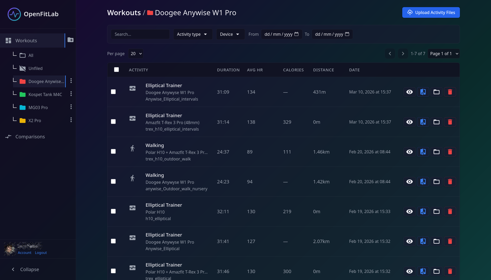
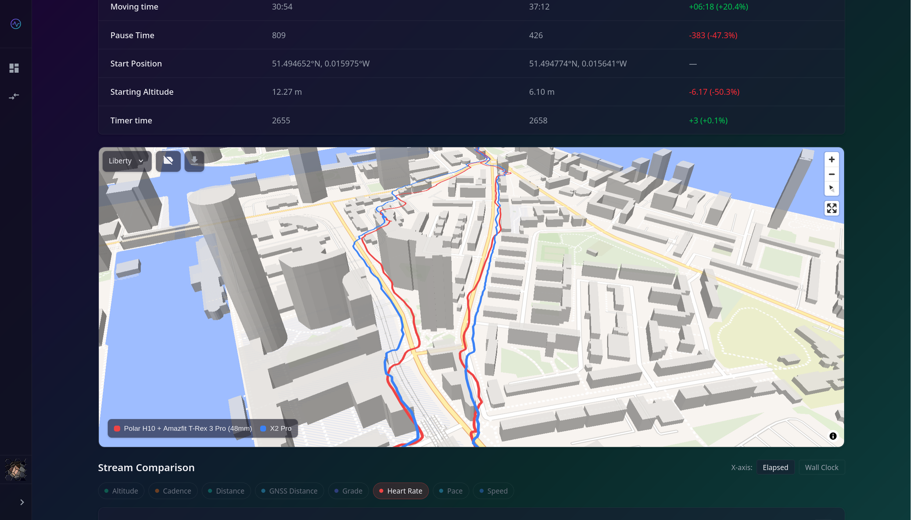
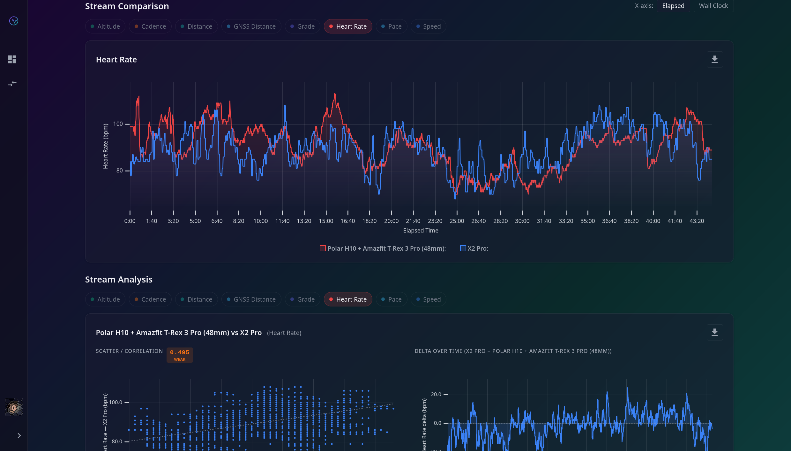
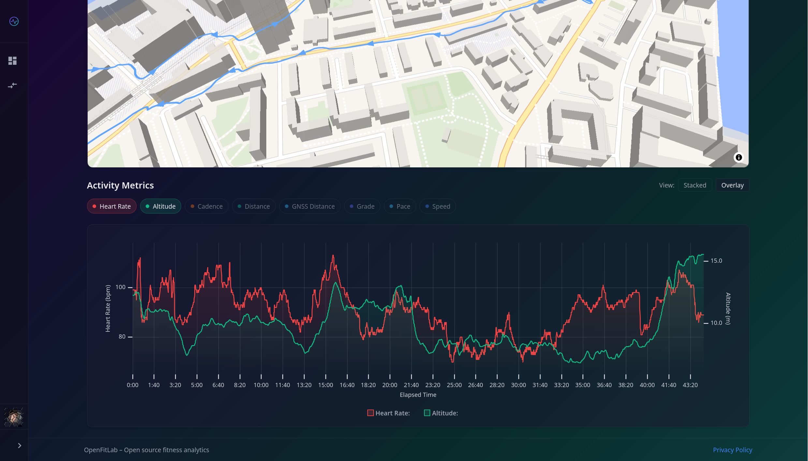
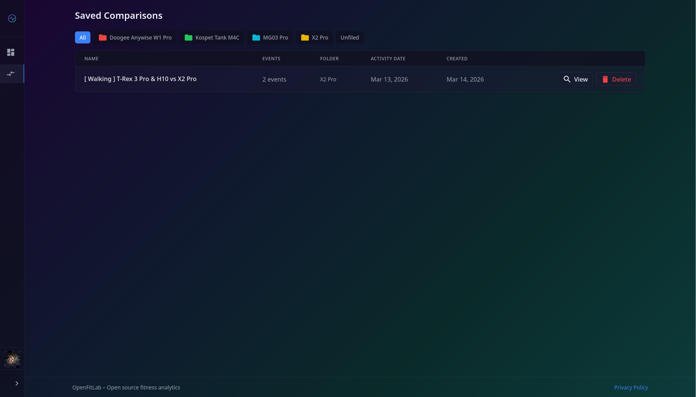

# OpenFitLab – Fitness Activity Tracker

A self-hosted fitness activity tracking and comparison platform. Upload activity files (TCX, FIT, GPX) from your fitness devices, visualize your workouts with interactive graphs, and compare activities side-by-side to analyze performance and compare data from different fitness trackers.

**Hosted instance:** https://openfitlab.org

## Features

- **File Upload**: Upload activity files in multiple formats (TCX, FIT, GPX, JSON, SML)
- **Activity Visualization**: View heart rate, cadence, pace, elevation, and other metrics in interactive graphs
- **Activity Comparison**: Compare two or more workouts side-by-side with merged views
- **Stream Analysis**: Analyze relationships between different data streams (correlation, XY plots, correlation indices)
- **Tracker Comparison**: Compare data from different fitness trackers to evaluate device accuracy



<details>
<summary>More screenshots</summary>

| | |
|---|---|
|  |  |
|  | |

</details>

## Architecture

High level: Svelte frontend → Express API → MariaDB; file parsing uses `@sports-alliance/sports-lib` on the API. See **[docs/ARCHITECTURE.md](docs/ARCHITECTURE.md)** for stack diagram, schema, API behaviour, and deployment.

## Prerequisites

- Docker and Docker Compose
- (Optional) Node 20+ for frontend, Node 24+ for backend if running outside Docker (see [AGENTS.md](AGENTS.md))

## Quick Start

From the project root:

```bash
docker compose up -d
```

This starts:
- **DB:** MariaDB on `localhost:3306` (user/password/database from `.env` or defaults in `compose.yaml`)
- **API:** http://localhost:3000 (GET `/` or `/health` returns `{ "ok": true }`)
- **Frontend:** http://localhost:4200 (Svelte/Vite dev server)
- **Adminer:** http://localhost:8080 (database admin UI)

## Development Mode

Compose uses base Node images (`node:24-alpine` for the API, `node:22-alpine` for the frontend) and **mounts** `./backend` and `./frontend` into each container. No Dockerfiles are built.

- **Backend:** `./backend` is mounted at `/app`; `node --watch` restarts the server when files under `src/` change.
- **Frontend:** `./frontend` is mounted at `/workspace/frontend`; Vite dev server hot-reloads on file changes.

Edit files under `backend/` or `frontend/` on your host and changes are reflected immediately (API restarts, frontend hot-reloads).

## Testing / Quality checks

- **Backend:** From `backend/`: `npm run format`, `npm run lint`, `npm run test` (full suite). See [AGENTS.md](AGENTS.md) for coverage and CI alignment.
- **Frontend:** From `frontend/`: `npm run ci` runs format, lint, typecheck, tests, and build.
- **CI:** Push and pull requests to `main` run backend checks when backend files change and frontend checks when frontend files change (see `.github/workflows/`).

## API Documentation

Machine-readable contract: [`backend/docs/openapi.yaml`](backend/docs/openapi.yaml). Human-oriented route list and shapes: [docs/ARCHITECTURE.md](docs/ARCHITECTURE.md).

## Production Build

Build the frontend for production:

```bash
cd frontend && npm run build
```

Output is in `frontend/dist/`. The build uses `/api` as the API base URL (proxied in dev, same-origin in production). Deploy the `dist/` folder to any static host and ensure `/api` routes to the Node API.

## Environment

Copy `.env.example` to `.env` and adjust if needed. Database defaults:

- `MARIADB_ROOT_PASSWORD=qsroot`
- `MARIADB_DATABASE=openfitlab`
- `MARIADB_USER=qs`, `MARIADB_PASSWORD=qspass`

Generate a session secret (required):

```bash
openssl rand -hex 32
```

Set the result as `SESSION_SECRET` in `.env`.

### Integrations (OAuth login and Strava)

At least one OAuth provider must be configured for login to work (only providers with credentials in `.env` appear on the login page). Optional Strava import is separate from login. Full setup: **[docs/INTEGRATIONS_INSTRUCTIONS.md](docs/INTEGRATIONS_INSTRUCTIONS.md)**.

## Backups (production compose stack)

See [`backup/README.md`](backup/README.md) for full details.

## Stop

```bash
docker compose down
```

Data in MariaDB is kept in the `db_data` volume. Use `docker compose down -v` to remove volumes.

## Documentation

- **[AGENTS.md](AGENTS.md)** - AI coding agent context and instructions
- **[docs/ARCHITECTURE.md](docs/ARCHITECTURE.md)** - Detailed system architecture
- **[docs/INTEGRATIONS_INSTRUCTIONS.md](docs/INTEGRATIONS_INSTRUCTIONS.md)** - OAuth providers (Google, GitHub, Apple, Facebook) and Strava import setup
- **[docs/PRD.md](docs/PRD.md)** - Product Requirements Document

## Key Architectural Decisions

Key decisions (file parsing on backend, relational stats storage, timestamped stream data, lightweight migration runner, self-hosted deployment) are documented in [docs/ARCHITECTURE.md](docs/ARCHITECTURE.md).
