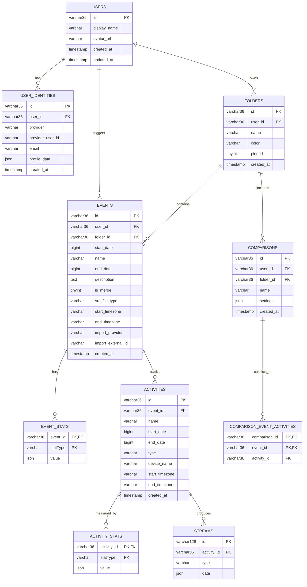

# Architecture Documentation

**Role:** Canonical technical reference for schema, API contracts, security, and architectural decisions. Agent quickstart and commands live in [AGENTS.md](../AGENTS.md). Product intent lives in [docs/PRD.md](PRD.md).

## System overview

OpenFitLab is a self-hosted fitness activity tracking app with:

- a Svelte frontend on port `4200`
- an Express API on port `3000`
- a MariaDB database on port `3306`
- Valkey-backed server sessions

Core flow:

1. The user signs in with Google, GitHub, Apple, or Facebook OAuth.
2. The API creates a server-side session and returns CSRF tokens from `GET /api/auth/me`.
3. The user uploads activity files.
4. The backend parses the files (TCX, FIT, GPX, JSON, SML via `@sports-alliance/sports-lib`), stores relational event/activity/stream data, and discards the originals.
5. The frontend reads event, stream, comparison, folder, and account data through authenticated API calls.

## Configuration, runtime, and deployment

- Backend config is read only from `backend/src/config.js`.
- Schema is managed by `db.runMigrations()`, which runs on startup. Migration SQL files live in `backend/sql/migrations/` (named `NNN_description.sql`, applied in lexicographic order). Applied filenames are tracked in a `schema_migrations` table. A MariaDB advisory lock (`GET_LOCK('openfitlab_migrations', 30)`) prevents race conditions when multiple replicas start simultaneously.
- To make a schema change, add a new `NNN_description.sql` file — never edit existing migration files. `backend/sql/schema.sql` is a human-readable reference snapshot and is not applied directly.
- Local development uses `docker compose up -d`.

### Compose stacks

Two stacks serve different purposes:

| Stack | File | Purpose |
|---|---|---|
| Development | `compose.yaml` | Source-mounted services with hot-reload |
| Production | `compose.prod.yaml` | Pre-built images from GHCR |

**Development services** (`compose.yaml`):
- `db` — MariaDB 12.2.2, port 3306, persistent volume `db_data`
- `valkey` — Valkey 8 Alpine (Redis-compatible session store), persistent volume `valkey_data`
- `api` — Node 24 Alpine, port 3000, source-mounted from `backend/`, runs `npm install && npm run dev`
- `frontend` — Node 22 Alpine, port 4200, source-mounted from repo root, runs `npm install && npm run dev`
- `adminer` — DB admin UI, port 8080

Health checks ensure `api` and `frontend` only start after `db` and `valkey` are healthy.

**Production services** (`compose.prod.yaml`):
- `db` and `valkey` — same images, restart: unless-stopped
- `api` — `ghcr.io/luispabon/openfitlab-backend:${OPENFITLAB_IMAGE_TAG:-main}` (default tag `main`), 2 replicas, Traefik labels
- `frontend` — `ghcr.io/luispabon/openfitlab-frontend:${OPENFITLAB_IMAGE_TAG:-main}`, 2 replicas, Traefik labels
- `backup` — optional (`profiles: backup`); scheduled DB dumps. `fake-gcs` / `fake-gcs-init` — optional (`profiles: dev-backup`) for local backup testing

### Dockerfiles

Both use multi-stage builds with named targets:

- **`backend/Dockerfile`**: `dev` target (Node 24 Alpine, `npm install`, `npm run dev`) and `prod` target (extends dev, `npm ci --omit=dev`, `node src/index.js`). Runs as non-root `appuser`.
- **`frontend/Dockerfile`**: `build` target (Node 24 Alpine, runs `npm ci && npm run build`) and `prod` target (Nginx Alpine serving the built `dist/`).

### Production networking

The prod stack uses two named networks:
- `internal` — db, valkey, api (not exposed externally)
- `dmz` — api, frontend (attached to an existing external network expected by Traefik)

Traefik terminates TLS and routes (see `compose.prod.yaml` labels; host is `${OPENFITLAB_DOMAIN:?...}`):
- `Host(...)` + `PathPrefix(/api/)` → api
- `Host(...)` (no path prefix) → frontend

Both services are tagged for Watchtower auto-updates.

### Container registry and CI/CD

Images are published to `ghcr.io/luispabon/openfitlab-backend` and `ghcr.io/luispabon/openfitlab-frontend` on every push to `main` via `.github/workflows/publish.yml`. Tags: `latest` and `sha-<short-hash>`. The `prod` target is built in CI.

Local publishing uses `make docker-push` (or `make docker-push-backend` / `make docker-push-frontend`).

### DAST (ZAP API scan)

Dynamic application security testing runs ZAP in API-scan mode against the OpenAPI spec (`backend/docs/openapi.yaml`).

**GitHub Actions** (`.github/workflows/dast.yml`): runs weekly (Tuesdays at 04:00 UTC) and on demand via `workflow_dispatch`. Not on every PR — stack spinup plus an active scan is too slow for a dev feedback loop.

**Local run** (`Makefile`):

| Target | Action |
|---|---|
| `make dast` | Full pipeline: start stack → seed user → run ZAP scan |
| `make dast-down` | Tear down DAST stack and remove volumes |

Both local and CI runs use the same strategy:

1. Start `db`, `valkey`, and `api` via `compose.dast.yaml` overlay.
2. Run `backend/scripts/dast-seed.mjs` inside the api container to insert a disposable test user in MariaDB and inject a pre-signed session into Valkey. No auth backdoor is added to the codebase.
3. Fetch a CSRF token from `GET /api/auth/me` using the seeded session cookie.
4. Run ZAP with two replacer rules that inject the session cookie and CSRF token as fixed headers on every request.

**`compose.dast.yaml` overlay:**
- Sets project name `openfitlab-dast` to avoid collisions with the dev stack.
- Relaxes all rate limits so ZAP's active scan is not throttled.
- Explicitly zeros all OAuth env vars (`GOOGLE_CLIENT_ID`, `GOOGLE_CLIENT_SECRET`, `GITHUB_CLIENT_ID`, `GITHUB_CLIENT_SECRET`, `APPLE_CLIENT_ID`, `APPLE_TEAM_ID`, `APPLE_KEY_ID`, `APPLE_PRIVATE_KEY`, `FACEBOOK_APP_ID`, `FACEBOOK_APP_SECRET`) so the API never redirects ZAP to external OAuth hosts. Without this, ZAP follows OAuth redirects and scans external hosts, producing false-positive findings.

Reports are written to `./zap-reports/` (gitignored locally; uploaded as a GitHub Actions artifact in CI).

### Environment variables

`.env.example` is the canonical reference with inline documentation. Copy it to `.env` before starting the dev stack.

Required in production only (names in `.env.example`; production compose may use `OPENFITLAB_*` prefixed vars — see `compose.prod.yaml`):
- `SESSION_SECRET` — min 32 chars, generate with `openssl rand -hex 32`
- `MARIADB_ROOT_PASSWORD`, `MARIADB_PASSWORD`
- `OAUTH_CALLBACK_URL` — public API base URL (no trailing slash); used for OAuth redirects

Optional: OAuth credentials (`GOOGLE_CLIENT_ID/SECRET`, `GITHUB_CLIENT_ID/SECRET`, `APPLE_CLIENT_ID/TEAM_ID/KEY_ID/PRIVATE_KEY`, `FACEBOOK_APP_ID/APP_SECRET`), **Strava import** (`STRAVA_CLIENT_ID`, `STRAVA_CLIENT_SECRET` — both required to enable Strava; register redirect `{OAUTH_CALLBACK_URL}/api/integrations/strava/callback` in the Strava app), rate limit overrides, `VITE_GA_MEASUREMENT_ID` (GA4 Measurement ID; presence enables frontend analytics).

`GET /api/auth/me` includes `integrations.providers.strava.configured` (boolean, no secrets) so the frontend can hide the Strava import entry when the API is not configured.

## Data model

### Core concepts

- **Event**: top-level workout session created from an uploaded file or a third-party import (v1: Strava).
- **Activity**: sport segment within an event.
- **Stream**: time-series data for an activity, such as heart rate or cadence.
- **Comparison**: saved selection of activities across events.
- **Folder**: user-owned organization unit for events and comparisons.

### Storage rules

- Event stats live in `event_stats`.
- Activity stats live in `activity_stats`.
- Stream points are stored as packed JSON arrays in `streams.data` (compressed). Each entry is `{ time, value }`.
- Comparison membership is relational in `comparison_event_activities`.
- Sessions are stored in Valkey, not in MariaDB.
- Events may store optional `import_provider` and `import_external_id` (e.g. Strava activity id). A unique index on `(user_id, import_provider, import_external_id)` prevents duplicate imports; both columns are NULL for file uploads.

### Tables

### Ownership and cascade behavior

- `users` own `folders`, `events`, and `comparisons`.
- Most child data is owned through foreign keys and uses `ON DELETE CASCADE`.
- `events.folder_id` and `comparisons.folder_id` use `ON DELETE SET NULL` so folder deletion can unfile content.
- Deleting an event is a service-level workflow: comparisons referencing the event are deleted first, then the event delete cascades remaining child rows.
- Each comparison references at most one activity per event (`comparison_event_activities` PK is `(comparison_id, event_id)`).

## API design

### Common behavior

- Protected routes require a valid session and are scoped to the authenticated user.
- Resource ownership is enforced with `req.userId`; request bodies do not decide ownership.
- Missing or not-owned resources return `404`.
- State-changing requests must include the CSRF token in a header (**CSRF-Token** as used by the SPA, or **x-csrf-token**; both accepted — value from `GET /api/auth/me`).
- JSON responses use millisecond timestamps.
- Error responses use `{ error: string }` with the appropriate HTTP status code.
- Backend error classes (`ParseError`, `ValidationError`, `NotFoundError` in `backend/src/errors.js`) set `statusCode`; the central error handler maps it to the HTTP response.

### Health

- `GET /`
- `GET /health`

Both return `{ ok: true }`.

### Authentication and account

- `GET /api/auth/google`
- `GET /api/auth/google/callback`
- `GET /api/auth/github`
- `GET /api/auth/github/callback`
- `GET /api/auth/apple`
- `POST /api/auth/apple/callback` (Apple uses `response_mode: form_post`)
- `GET /api/auth/facebook`
- `GET /api/auth/facebook/callback`

OAuth callbacks either:

- create a normal authenticated session and redirect to the SPA, or
- create a temporary pending-signup session and redirect the SPA to signup completion

**Account linking:** when a user signs in with a new provider whose verified email matches an existing identity, the new identity is linked to the existing user automatically. No separate linking UI exists.

Other auth endpoints:

- `GET /api/auth/me`
  - authenticated response: `{ id, displayName, avatarUrl, integrations, csrfToken }` — `integrations.providers.strava.configured` indicates whether Strava OAuth is available (no secrets).
  - pending-signup response: `{ pendingSignup: true, profile, integrations, csrfToken }`
  - unauthenticated response: `401`
- `POST /api/auth/logout`
- `POST /api/auth/complete-signup`
- `POST /api/auth/decline-signup`

Account endpoints:

- `GET /api/account/export?includeStreams=true`
- `DELETE /api/account`

### Events

- `GET /api/events`
  - filters: `startDate`, `endDate`, `limit`, `folderId`
  - returns event summaries with `stats`, optional `srcFileType`, optional timezones, and `folderId`
- `GET /api/events/activity-rows`
  - filters: `limit`, `offset`, `startDate`, `endDate`, `activityTypes`, `devices`, `search`, `folderId`
  - returns `{ rows, total }` where each row is `{ event, activity }`
- `GET /api/events/:id`
  - returns `{ event, activities }`
- `GET /api/events/:id/candidates?sameFolderOnly=true|false`
  - returns comparison candidates for the source event
- `POST /api/events`
  - multipart upload field: `files` (1-10 files; TCX, FIT, GPX, JSON, SML)
  - optional body field: `folderId`
  - returns `{ results }` where each entry is either:
    - success: `{ success: true, filename, id, event, activities }`
    - failure: `{ success: false, filename, error }`
- `PATCH /api/events/:id`
  - updates event folder assignment via `{ folderId }`
- `PATCH /api/events/:id/activities/:activityId`
  - updates activity fields via `{ type?, deviceName? }`
- `GET /api/events/:id/activities/:activityId/streams`
  - optional query `types`
  - returns `[{ type, data: [{ time, value }] }]`
- `DELETE /api/events/:id`
- `GET /api/events/:id/export/tcx`
  - returns a TCX file download with all stored stream data (heart rate, cadence, speed, power, altitude, distance, temperature, GPS where available)
  - 404 if event not found or not owned
- `GET /api/events/:id/export/gpx`
  - returns a GPX file download; only available when the event has GPS streams (Latitude/Longitude or Position)
  - 404 if event not found, not owned, or has no GPS streams

### Strava import (v1)

Requires `STRAVA_CLIENT_ID` and `STRAVA_CLIENT_SECRET` in the environment (see `.env.example`). Register redirect URI `{OAUTH_CALLBACK_URL}/api/integrations/strava/callback` in the Strava application settings.

- **OAuth:** `GET /api/integrations/strava/authorize` (session required) redirects to Strava; `GET /api/integrations/strava/callback` exchanges the code and stores `access_token` + expiry **in the session only** (Valkey). Refresh tokens are not persisted.
- **API:** `GET /api/integrations/strava/status`, `GET /api/integrations/strava/activities`, `POST /api/integrations/strava/import` (CSRF + optional `Idempotency-Key`, outcomes cached in Valkey ~24h).
- **Driver:** `backend/src/integrations/strava-driver.js` — HTTP to Strava only; bounded concurrency for per-activity requests; maps streams into the same canonical shape as sports-lib for `persistParsedEvent`.
- **Rate limits:** list/import routes use the same per-window cap as uploads (`UPLOAD_RATE_LIMIT_*`). Strava 429 responses surface a single user-facing message; `Retry-After` is forwarded when Strava sends it.
- **Timeouts:** Strava HTTP calls use ~45s request timeouts (see driver).

### Folders

- `GET /api/folders`
- `POST /api/folders`
- `GET /api/folders/:id`
- `PATCH /api/folders/:id`
- `DELETE /api/folders/:id?contents=unfile|delete`

Folder semantics:

- folder selection uses `all`, `unfiled`, or a folder UUID
- deleting with `contents=unfile` keeps items and clears `folder_id`
- deleting with `contents=delete` removes folder contents

### Comparisons

- `POST /api/comparisons`
  - body: `{ name, activityIds, settings?, folderId? }`
- `GET /api/comparisons?folderId=...`
- `POST /api/comparisons/by-events`
  - body: `{ eventIds }`
- `GET /api/comparisons/:id`
- `DELETE /api/comparisons/:id`
- `PATCH /api/comparisons/:id/settings`
  - body: `{ settings }` where settings may include `selectedStreams`, `xAxisMode`, `hiddenStats`, and `referenceActivityId`
  - `referenceActivityId` must be a valid UUID or null; it identifies which activity acts as the reference baseline for stream analysis and delta columns

Comparison responses include:

- `id`, `name`
- `eventIds`
- `activityIds`
- optional `settings` — includes `selectedStreams`, `xAxisMode`, `hiddenStats`, `referenceActivityId`
- optional `folderId`
- optional `mixed` — `true` when the comparison's activities span more than one folder (events in different folders). Computed from `events.folder_id` for each activity at query time.
- optional `surfaced` — `true` when a folder-filtered list includes a comparison whose own `folder_id` differs from the requested folder, because one of its events belongs to that folder. Surfaced comparisons appear in the folder view but are not filed there.
- optional `createdAt`

### Stream analysis (frontend-only)

Stream analysis (alignment, scatter, regression, delta series) runs entirely client-side in `frontend/src/lib/utils/stream-analysis.ts` and related comparison-view components. No API endpoints.

### Image export (frontend-only)

Users can export sections of the comparison view as PNG files using client-side DOM capture (`frontend/src/lib/utils/export-image.ts`, `html-to-image`). No API endpoints. Elements marked `data-export-exclude` are omitted from captures (e.g. export controls). Map exports require WebGL readback support where the map component enables it.

### File export (TCX/GPX)

Users can download activity data reconstructed from stored event, activity, stats, and
stream data. The original uploaded file is discarded after processing; exports are a
best-effort reconstruction from what was stored.

**Behaviour**

- TCX: TCX 2.0 with one `<Lap>` per activity; lap summaries use stored activity stats (time, distance, max speed, calories, heart rate where available); device name in `<Creator>` when stored; sport type mapped from stored activity type.
- GPX: GPX 1.1 with one `<trkseg>` per activity when GPS streams exist (Latitude/Longitude or Position); extensions include heart rate, cadence, power, temperature where stored; `buildGpx` returns `null` when no GPS streams.
- Trackpoints: union of stream timestamps; each stream value resolved by nearest-neighbour lookup (30-second tolerance in `trackpoint-builder.js`).
- Multi-activity events: single download file (multiple laps / track segments).
- Filenames derive from the event name.

**Implementation**

- `backend/src/services/export-service.js`: `exportEventAsTcx`, `exportEventAsGpx`.
- `backend/src/utils/tcx-builder.js`, `backend/src/utils/gpx-builder.js`, `backend/src/utils/trackpoint-builder.js`.
- `frontend/src/lib/api/export.ts`: `downloadEventTcx`, `downloadEventGpx`.
- `frontend/src/lib/components/EventExportDropdown.svelte`: event detail export dropdown; always shows that exports are reconstructed from stored data.

FIT export is not implemented (no maintained Node FIT writer suitable for this stack at time of writing).

### Meta

- `GET /api/activity-types`
- `GET /api/devices`

These derive distinct values from the authenticated user's data.

## Frontend contract

The frontend consumes API JSON directly.

Important modules:

- `frontend/src/lib/utils/export-image.ts`: `exportAsPng` helper for DOM-to-PNG capture (see [Image export (frontend-only)](#image-export-frontend-only))
- `frontend/src/lib/api/client.ts`: authenticated fetch wrapper with CSRF handling
- `frontend/src/lib/api/events.ts`: event, activity, stream, and upload API calls
- `frontend/src/lib/api/export.ts`: TCX and GPX file download functions
- `frontend/src/lib/api/comparisons.ts`: comparison CRUD and candidate lookup
- `frontend/src/lib/api/folders.ts`: folder CRUD
- `frontend/src/lib/api/account.ts`: export and account deletion
- `frontend/src/lib/api/auth.ts`: auth check and logout
- `frontend/src/lib/stores/auth.svelte.ts`: auth state, CSRF token, login state
- `frontend/src/lib/stores/folders.svelte.ts`: folder list and selection state
- `frontend/src/lib/types/event.ts`: canonical frontend shapes for events, activities, streams, folders, and comparisons

Primary route usage:

- `workouts.svelte`: activity rows, uploads, filters, delete flows, folder views
- `event-detail.svelte`: event detail, stream loading, activity edits
- `comparisons.svelte`: comparison list and delete flow
- `comparison-view.svelte`: comparison creation/view flows
- `account.svelte`: export and account deletion

## Security and ownership invariants

- Sessions use `express-session` with a Valkey-backed `connect-redis` store.
- Session cookie name is `ofl.sid`.
- Cookies are `HttpOnly`, `SameSite=Lax`, and `Secure` in production.
- CSRF protection is session-based and applied before protected state-changing requests.
- Repositories and services enforce ownership with `user_id` / `req.userId`.
- Parameterized SQL is used through repository helpers.
- Auth, callback, upload, and general API routes are rate-limited.
- All API responses set `Cache-Control: no-store` to prevent proxy or browser caching of session-scoped data.
- Gzip decompression of uploaded files is capped at 100 MB (`MAX_DECOMPRESSED_BYTES` in `file-parser.js`) to prevent decompression DoS (gzip bomb). Multer's 50 MB `fileSize` limit applies to compressed bytes only.
- `folderId` in upload requests is validated as a UUID before any DB query, consistent with the event PATCH endpoint.

## Architectural decisions

- **Backend parsing:** files are parsed on the server with `@sports-alliance/sports-lib`.
- **No original file storage:** uploaded files are discarded after parsing.
- **Relational stats:** event/activity stats are normalized into separate tables.
- **Packed stream data:** stream samples are stored as compressed JSON arrays in `streams.data` for efficiency (~30-50x size reduction).
- **Server-managed auth:** OAuth plus server sessions, not client-managed tokens.
- **Lightweight migration runner:** SQL files in `backend/sql/migrations/` applied in order on startup with an advisory lock, enabling schema evolution without data loss.

## Source references

- App bootstrap: `backend/src/index.js`
- Config: `backend/src/config.js`
- Schema: `backend/sql/schema.sql`
- Auth routes: `backend/src/routes/auth.js`
- Event routes: `backend/src/routes/events.js`
- Comparison routes: `backend/src/routes/comparisons.js`
- Folder routes: `backend/src/routes/folders.js`
- Meta routes: `backend/src/routes/meta.js`
- Response shaping: `backend/src/utils/transforms.js`
- Input validation: `backend/src/utils/validation.js`
- Error classes: `backend/src/errors.js`
- Frontend types: `frontend/src/lib/types/event.ts`
