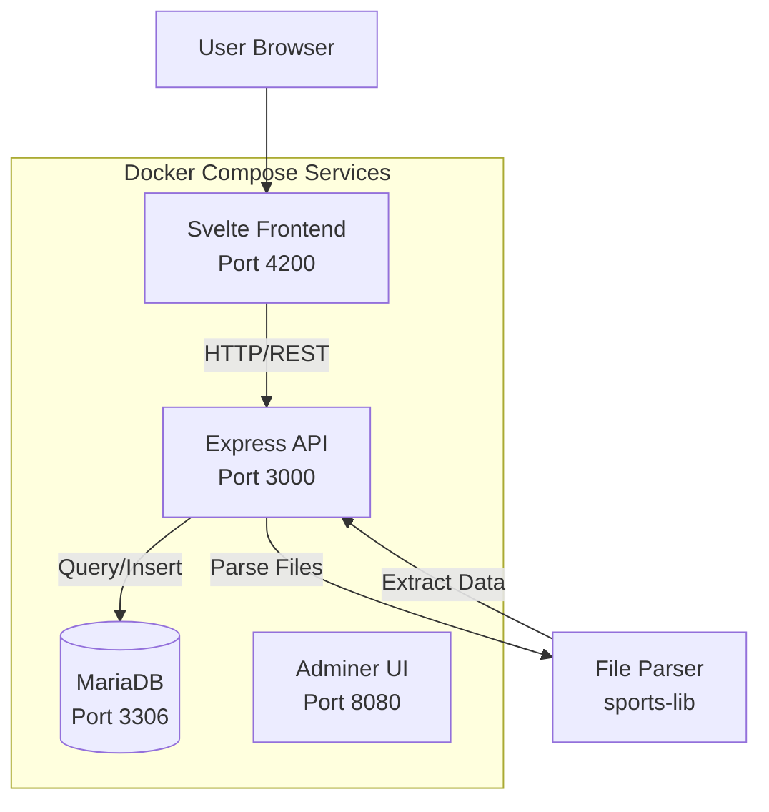
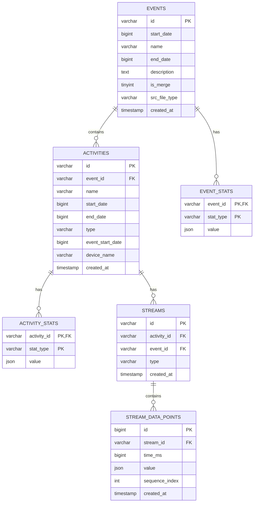
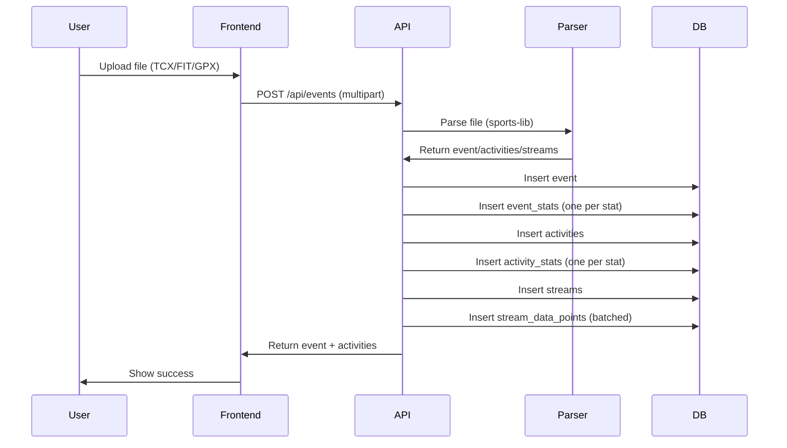
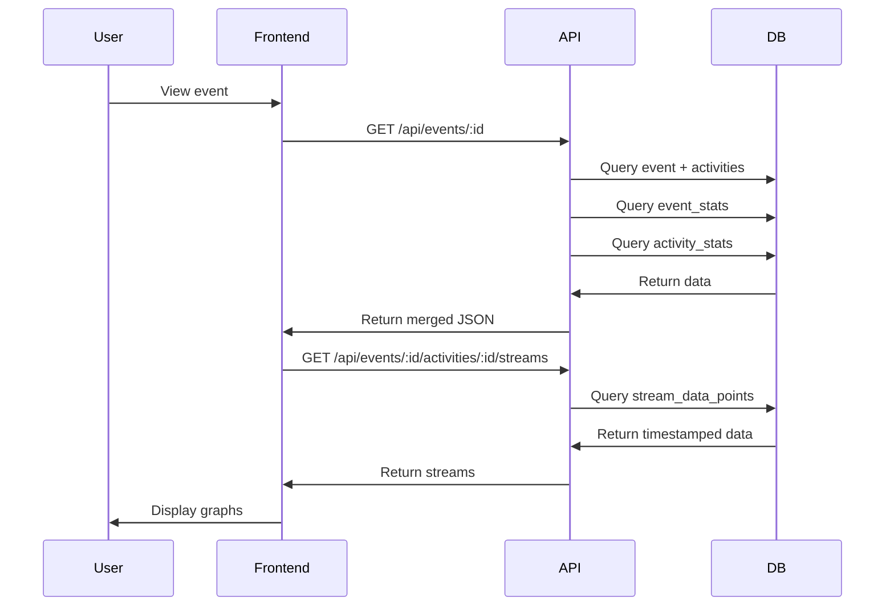

# Architecture Documentation

## System Overview

OpenFitLab is a self-hosted fitness activity tracking platform that allows users to upload activity files, visualize workout data, and compare activities from different fitness trackers.



## Technology Stack

### Backend
- **Runtime**: Node.js 24+
- **Framework**: Express.js 4.x
- **Database**: MariaDB 12.2+ (MySQL compatible)
- **Database Driver**: mysql2 (with promise support)
- **File Parsing**: `@sports-alliance/sports-lib` v6.1.14
- **XML Parsing**: xmldom v0.6.0
- **File Upload**: multer v1.4.5

### Frontend
- **Framework**: Svelte 5
- **Build Tool**: Vite 7
- **Language**: TypeScript 5.9
- **Styling**: Tailwind CSS v4
- **Router**: svelte-spa-router
- **API Client**: Native `fetch()` API

## Database Schema

### Entity Relationship Diagram



All relationships use foreign keys with **ON DELETE CASCADE**: deleting an event removes its event_stats and activities; deleting an activity removes its activity_stats and streams; deleting a stream removes its stream_data_points. Event delete is implemented as a single `DELETE FROM events WHERE id = ?`.

### Event vs Activity: Core Concepts

Product definitions: [docs/PRD.md](docs/PRD.md) §10.1 Glossary. Below: technical implementation (tables, relationships).

Understanding the distinction between **Events** and **Activities** is fundamental to the data model:

#### Event
An **Event** is a top-level workout session that represents a single workout file upload. Key characteristics:

- **One file = One event**: When you upload a TCX, FIT, GPX, JSON, or SML file, it creates one event
- **Container for activities**: An event can contain one or more activities
- **Event-level stats**: Aggregated statistics across all activities in the event (e.g., total duration, total distance)
- **Event metadata**: Name (derived from filename), start/end dates, description

#### Activity
An **Activity** is an individual sport segment within an event. Key characteristics:

- **Belongs to an event**: Each activity has an `event_id` foreign key
- **Has a sport type**: Running, Cycling, Swimming, etc.
- **Activity-level stats**: Statistics specific to that activity (e.g., average pace, max heart rate)
- **Owns streams**: All time-series data (heart rate, GPS, cadence, etc.) belongs to activities, not events
- **Can have multiple per event**: Multi-sport events (like triathlons) contain multiple activities

#### Examples

**Single-Sport Workout** (most common):
- **Event**: "Morning Run" (from `morning-run.tcx`)
  - **Activity 1**: Running (type: "Running")
    - Streams: Heart Rate, GPS Position, Cadence, Pace

**Multi-Sport Workout** (triathlon):
- **Event**: "Triathlon Race 2025" (from `triathlon-2025.fit`)
  - **Activity 1**: Swimming (type: "Swimming")
    - Streams: Heart Rate, GPS Position
  - **Activity 2**: Cycling (type: "Cycling")
    - Streams: Heart Rate, GPS Position, Cadence, Power
  - **Activity 3**: Running (type: "Running")
    - Streams: Heart Rate, GPS Position, Cadence, Pace

**Key Relationships**:
- Events have event-level statistics (`event_stats` table)
- Activities have activity-level statistics (`activity_stats` table)
- Streams belong to activities (`streams.activity_id`)
- Stream data points belong to streams (`stream_data_points.stream_id`)

### Table Descriptions

#### events
Top-level workout sessions. Each event represents a single workout session and can contain multiple activities.

- `id`: UUID (VARCHAR(36))
- `start_date`: Start timestamp in milliseconds (BIGINT)
- `name`: Event name (derived from filename)
- `end_date`: End timestamp (nullable)
- `description`: Event description (nullable)
- `is_merge`: Boolean flag indicating merged events
- `src_file_type`: Source file extension (e.g. "tcx", "fit") (VARCHAR(16), nullable)
- `created_at`: Row creation timestamp

#### event_stats
Relational storage for event-level statistics. One row per stat type.

- `event_id`: Foreign key to events
- `stat_type`: Stat type name (e.g., "Duration", "Distance", "Average Heart Rate")
- `value`: Stat value (JSON, can be number, string, array, or object)
- Primary key: `(event_id, stat_type)`

#### activities
Individual activities within an event. An event can contain multiple activities (e.g., multi-sport events).

- `id`: UUID (VARCHAR(36))
- `event_id`: Foreign key to events
- `name`: Activity name
- `start_date`: Activity start timestamp
- `end_date`: Activity end timestamp
- `type`: Activity type (e.g., "Running", "Cycling", "Swimming")
- `event_start_date`: Denormalized event start date for convenience
- `device_name`: Device or tracker name (e.g. "Garmin Forerunner 945") (VARCHAR(255), nullable)
- `created_at`: Row creation timestamp

#### activity_stats
Relational storage for activity-level statistics. One row per stat type.

- `activity_id`: Foreign key to activities
- `stat_type`: Stat type name
- `value`: Stat value (JSON)
- Primary key: `(activity_id, stat_type)`

#### streams
Stream metadata. Each stream represents a time-series data type (heart rate, cadence, pace, elevation, etc.).

- `id`: Composite ID (`{activity_id}_{type}`)
- `activity_id`: Foreign key to activities
- `event_id`: Foreign key to events (denormalized for query efficiency)
- `type`: Stream type (e.g., "Heart Rate", "Cadence", "Pace")
- Unique constraint: `(activity_id, type)`

#### stream_data_points
Timestamped data points for each stream. Stored relationally with timestamps for efficient querying.

- `id`: Auto-increment primary key
- `stream_id`: Foreign key to streams
- `time_ms`: Timestamp in milliseconds (UTC, BIGINT)
- `value`: Data point value (JSON, can be number or object)
- `sequence_index`: Ordering index for data points
- Indexes: `(stream_id, time_ms)`, `stream_id`, `time_ms`

#### comparisons
Saved comparison definitions (optional feature). Not linked by foreign key to events.

- `id`: UUID primary key
- `name`: User-defined name
- `event_ids`: JSON array of event UUIDs
- `settings`: JSON (e.g. selectedStreams, xAxisMode, selectedActivities)
- `created_at`: Row creation timestamp

## API Design

### REST Endpoints

#### GET /api/events
List events with optional filtering.

**Query Parameters:**
- `startDate` (number, optional): Filter events starting from this timestamp
- `endDate` (number, optional): Filter events ending before this timestamp
- `limit` (number, optional): Maximum number of results (default: 50, max: 200)

**Response:**
```json
[
  {
    "id": "uuid",
    "startDate": 1771317117000,
    "name": "Morning Run",
    "endDate": 1771318965000,
    "stats": {
      "Duration": 1848,
      "Distance": 1594,
      "Average Heart Rate": 85
    },
    "srcFileType": "tcx"
  }
]
```

#### GET /api/events/:id
Get a single event with all activities.

**Response:**
```json
{
  "event": {
    "id": "uuid",
    "startDate": 1771317117000,
    "name": "Morning Run",
    "stats": { ... },
    "srcFileType": "tcx"
  },
  "activities": [
    {
      "id": "uuid",
      "eventID": "uuid",
      "eventStartDate": 1771317117000,
      "name": "Running",
      "startDate": 1771317117000,
      "type": "Running",
      "stats": { ... },
      "deviceName": "Garmin Forerunner 945"
    }
  ]
}
```

#### GET /api/events/:id/activities/:activityId/streams
Get stream data for a specific activity.

**Query Parameters:**
- `types` (string|string[], optional): Filter by stream types

**Response:**
```json
[
  {
    "type": "Heart Rate",
    "data": [
      { "time": 1771317117000, "value": 120 },
      { "time": 1771317118000, "value": 125 },
      ...
    ]
  },
  {
    "type": "Cadence",
    "data": [
      { "time": 1771317117000, "value": 85 },
      ...
    ]
  }
]
```

#### POST /api/events
Upload and parse a file.

**Request:**
- Content-Type: `multipart/form-data`
- Body: `files` (File or File[])

**Response:**
```json
{
  "id": "uuid",
  "event": { ... },
  "activities": [ ... ]
}
```

**Process:**
1. Receive file upload
2. Parse file using `@sports-alliance/sports-lib`
3. Extract event, activities, and streams
4. Store in database (events, activities, stats, streams, stream_data_points)
5. Discard original file
6. Return parsed data

#### DELETE /api/events/:id
Delete an event and all related data.

**Response:**
- 204 No Content (success)
- 404 Not Found (event doesn't exist)

**Cascade Deletion:**
1. Delete `activity_stats` for all activities
2. Delete `event_stats` for event
3. Delete `stream_data_points` for all streams
4. Delete `streams` for event
5. Delete `activities` for event
6. Delete `events` record

## Data Flow

### Upload Flow



### Visualization Flow



## Frontend Architecture

### Component Structure

```
frontend/src/
├── lib/
│   ├── api/
│   │   └── events.ts          # API client (fetch-based)
│   ├── types/
│   │   └── event.ts           # TypeScript interfaces
│   ├── utils/
│   │   ├── format-date.ts     # Date formatting
│   │   ├── activity-icons.ts  # Activity type icon mapping
│   │   └── stats.ts           # Stat icon/label/unit helpers
│   └── components/            # Reusable UI components
├── routes/
│   ├── dashboard.svelte       # Event list view with upload
│   └── event-detail.svelte    # Event detail with stats
├── App.svelte                 # Layout shell and router
└── main.ts                    # Application entry point
```

### Key Components

- **Dashboard**: Lists all events in a table, handles file uploads
- **EventDetail**: Displays event details, hero metrics, and stats grid

### API Layer

- **events.ts**: Fetch-based API client with functions for all endpoints
- Works directly with API JSON responses (no client-side sports-lib dependency)

## Key Architectural Decisions

### 1. File Parsing on Backend
**Decision**: Parse files server-side, not client-side.

**Rationale**: Consistent parsing and validation; handles large files without browser limits. Files are parsed and discarded (no storage).

### 2. Relational Stats Storage
**Decision**: Store statistics in separate tables (`event_stats`, `activity_stats`) with one row per stat type.

**Rationale**: Enables efficient querying and indexing by stat type; easier to extend than JSON blobs.

### 3. Timestamped Stream Data Points
**Decision**: Store stream data points relationally with `time_ms` (BIGINT) timestamps.

**Rationale**: Efficient time-range queries and indexing; enables time-based comparisons; better than JSON arrays.

### 4. No File Storage
**Decision**: Parse files and discard them, don't store originals.

**Rationale**: Reduces storage; all data in DB for regeneration; simpler architecture; users can re-upload.

### 5. No Database Migrations
**Decision**: Schema runs on startup via `initializeSchema()`, no migration system.

**Rationale**: Simpler for self-hosted; schema changes require DB recreate (acceptable); clear versioning via `schema.sql`.

### 6. Self-Hosted Deployment
**Decision**: Docker Compose is the deployment artifact.

**Rationale**: User owns data; no cloud lock-in; one-command deployment on any host with Docker.

## Deployment options

- **Self-hosted**: Docker Compose (default). One command; no cloud account required.
- **Cloud**: Frontend on object storage (S3 or Firebase Hosting), API on small or serverless compute (App Runner, Cloud Run), database as a managed service (RDS, Cloud SQL). Single domain with path-based routing so the app keeps calling `/api` (same-origin). No load balancer required when using CloudFront (AWS) or Firebase Hosting / single Cloud Run (GCP).

See [docs/HOSTING.md](HOSTING.md) for detailed AWS and GCP plans, cost estimates, and a production checklist.

## Security Considerations

- **CORS**: Enabled for all origins in dev (should be restricted in production)
- **File Upload**: Limited to supported formats (TCX, FIT, GPX, JSON, SML)
- **SQL Injection**: Uses parameterized queries via mysql2
- **Authentication**: Not yet implemented (single-user mode)
- **File Size**: No explicit limits (relies on Express defaults)

## Performance Considerations

- **Database Indexes**: Indexes on foreign keys and time ranges
- **Batch Inserts**: Stream data points inserted in batches of 1000
- **Connection Pooling**: MySQL connection pool (limit: 10)
- **JSON Parsing**: Handles both object and string JSON from database
- **Query Optimization**: Uses `IN` clauses for batch stat loading

## Future Enhancements

- Authentication and multi-user support
- Advanced analytics and correlation analysis
- Additional file format support
- Export functionality
- Mobile app support
- Real-time data sync from fitness trackers
