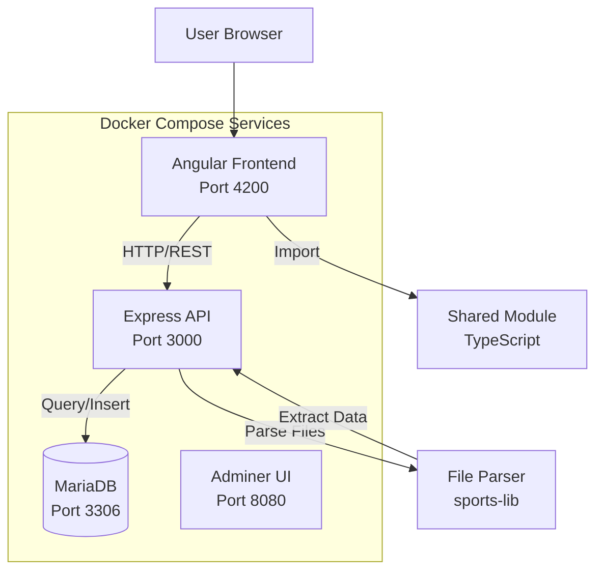
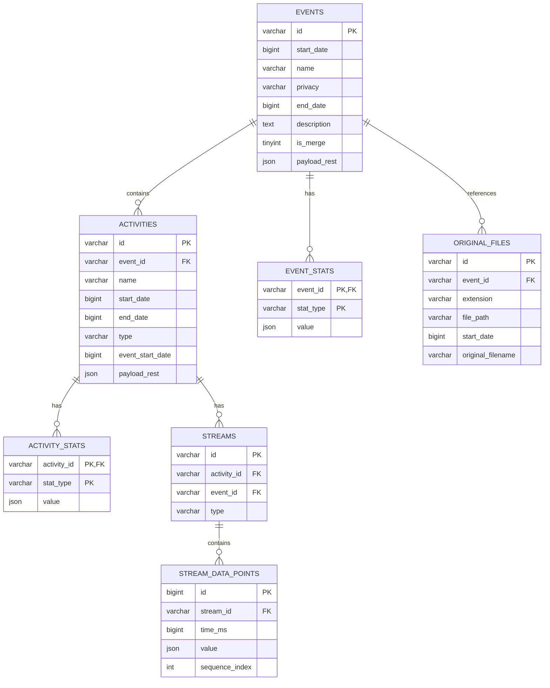
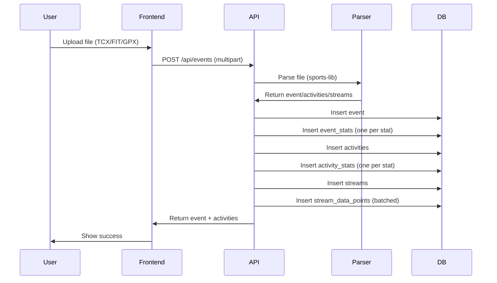
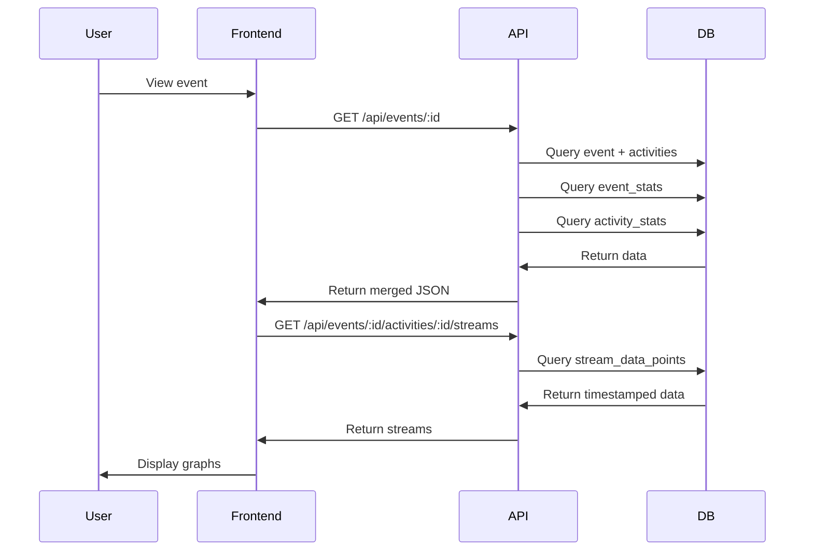

# Architecture Documentation

## System Overview

OpenFitLab is a self-hosted fitness activity tracking platform that allows users to upload activity files, visualize workout data, and compare activities from different fitness trackers.



## Technology Stack

### Backend
- **Runtime**: Node.js 24+
- **Framework**: Express.js 4.x
- **Database**: MariaDB 12.2+ (MySQL compatible)
- **Database Driver**: mysql2 (with promise support)
- **File Parsing**: `@sports-alliance/sports-lib` v6.1.14
- **XML Parsing**: xmldom v0.6.0
- **File Upload**: multer v1.4.5

### Frontend
- **Framework**: Angular 20.3
- **Language**: TypeScript 5.8
- **UI Library**: Angular Material 20.2
- **Reactive Programming**: RxJS 7.8
- **Data Processing**: `@sports-alliance/sports-lib` v6.1.14

### Shared
- **Language**: TypeScript
- **Purpose**: Common code shared between frontend and backend

## Database Schema

### Entity Relationship Diagram



### Table Descriptions

#### events
Top-level workout sessions. Each event represents a single workout session and can contain multiple activities.

- `id`: UUID (VARCHAR(36))
- `start_date`: Start timestamp in milliseconds (BIGINT)
- `name`: Event name (derived from filename)
- `privacy`: Privacy setting (default: 'private')
- `end_date`: End timestamp (nullable)
- `description`: Event description (nullable)
- `is_merge`: Boolean flag indicating merged events
- `payload_rest`: JSON blob for additional metadata

#### event_stats
Relational storage for event-level statistics. One row per stat type.

- `event_id`: Foreign key to events
- `stat_type`: Stat type name (e.g., "Duration", "Distance", "Average Heart Rate")
- `value`: Stat value (JSON, can be number, string, array, or object)
- Primary key: `(event_id, stat_type)`

#### activities
Individual activities within an event. An event can contain multiple activities (e.g., multi-sport events).

- `id`: UUID (VARCHAR(36))
- `event_id`: Foreign key to events
- `name`: Activity name
- `start_date`: Activity start timestamp
- `end_date`: Activity end timestamp
- `type`: Activity type (e.g., "Running", "Cycling", "Swimming")
- `event_start_date`: Denormalized event start date for convenience
- `payload_rest`: JSON blob for additional metadata (creator, laps, intensity zones, etc.)

#### activity_stats
Relational storage for activity-level statistics. One row per stat type.

- `activity_id`: Foreign key to activities
- `stat_type`: Stat type name
- `value`: Stat value (JSON)
- Primary key: `(activity_id, stat_type)`

#### streams
Stream metadata. Each stream represents a time-series data type (heart rate, cadence, pace, elevation, etc.).

- `id`: Composite ID (`{activity_id}_{type}`)
- `activity_id`: Foreign key to activities
- `event_id`: Foreign key to events (denormalized for query efficiency)
- `type`: Stream type (e.g., "Heart Rate", "Cadence", "Pace")
- Unique constraint: `(activity_id, type)`

#### stream_data_points
Timestamped data points for each stream. Stored relationally with timestamps for efficient querying.

- `id`: Auto-increment primary key
- `stream_id`: Foreign key to streams
- `time_ms`: Timestamp in milliseconds (UTC, BIGINT)
- `value`: Data point value (JSON, can be number or object)
- `sequence_index`: Ordering index for data points
- Indexes: `(stream_id, time_ms)`, `stream_id`, `time_ms`

#### original_files
Metadata about uploaded files (currently not used, files are parsed and discarded).

- `id`: UUID
- `event_id`: Foreign key to events
- `extension`: File extension
- `file_path`: File path (if stored)
- `start_date`: File start date
- `original_filename`: Original filename

## API Design

### REST Endpoints

#### GET /api/events
List events with optional filtering.

**Query Parameters:**
- `startDate` (number, optional): Filter events starting from this timestamp
- `endDate` (number, optional): Filter events ending before this timestamp
- `limit` (number, optional): Maximum number of results (default: 50, max: 200)

**Response:**
```json
[
  {
    "id": "uuid",
    "startDate": 1771317117000,
    "name": "Morning Run",
    "privacy": "private",
    "endDate": 1771318965000,
    "stats": {
      "Duration": 1848,
      "Distance": 1594,
      "Average Heart Rate": 85
    },
    "payload_rest": { ... }
  }
]
```

#### GET /api/events/:id
Get a single event with all activities.

**Response:**
```json
{
  "event": {
    "id": "uuid",
    "startDate": 1771317117000,
    "name": "Morning Run",
    "stats": { ... },
    "payload_rest": { ... }
  },
  "activities": [
    {
      "id": "uuid",
      "eventID": "uuid",
      "eventStartDate": 1771317117000,
      "name": "Running",
      "startDate": 1771317117000,
      "type": "Running",
      "stats": { ... },
      "payload_rest": { ... }
    }
  ]
}
```

#### GET /api/events/:id/activities/:activityId/streams
Get stream data for a specific activity.

**Query Parameters:**
- `types` (string|string[], optional): Filter by stream types

**Response:**
```json
[
  {
    "type": "Heart Rate",
    "data": [
      { "time": 1771317117000, "value": 120 },
      { "time": 1771317118000, "value": 125 },
      ...
    ]
  },
  {
    "type": "Cadence",
    "data": [
      { "time": 1771317117000, "value": 85 },
      ...
    ]
  }
]
```

#### POST /api/events
Upload and parse a file.

**Request:**
- Content-Type: `multipart/form-data`
- Body: `files` (File or File[])

**Response:**
```json
{
  "id": "uuid",
  "event": { ... },
  "activities": [ ... ]
}
```

**Process:**
1. Receive file upload
2. Parse file using `@sports-alliance/sports-lib`
3. Extract event, activities, and streams
4. Store in database (events, activities, stats, streams, stream_data_points)
5. Discard original file
6. Return parsed data

#### DELETE /api/events/:id
Delete an event and all related data.

**Response:**
- 204 No Content (success)
- 404 Not Found (event doesn't exist)

**Cascade Deletion:**
1. Delete `activity_stats` for all activities
2. Delete `event_stats` for event
3. Delete `stream_data_points` for all streams
4. Delete `streams` for event
5. Delete `activities` for event
6. Delete `original_files` for event
7. Delete `events` record

## Data Flow

### Upload Flow



### Visualization Flow



## Frontend Architecture

### Component Structure

```
frontend/src/app/
├── components/
│   ├── dashboard/          # Event list view
│   ├── upload/            # File upload component
│   └── event-detail/      # Event detail with graphs
├── services/
│   ├── api-event.service.ts    # API client
│   ├── app.processing.service.ts
│   └── logger.service.ts
└── constants/
    └── single-user.ts      # User constants
```

### Key Components

- **DashboardComponent**: Lists all events in a table
- **UploadActivitiesComponent**: Handles file uploads
- **EventDetailComponent**: Displays event details and visualizations

### Services

- **ApiEventService**: Communicates with backend API
- **AppProcessingService**: Handles file processing logic
- **LoggerService**: Logging utility

## Key Architectural Decisions

### 1. File Parsing on Backend
**Decision**: Parse files server-side, not client-side.

**Rationale**:
- Consistent parsing logic across clients
- Better error handling and validation
- Can handle large files without browser memory issues
- Files are parsed and discarded (no storage needed)

### 2. Relational Stats Storage
**Decision**: Store statistics in separate tables (`event_stats`, `activity_stats`) with one row per stat type.

**Rationale**:
- Enables efficient querying by stat type
- Allows indexing on stat types
- Easier to add new stat types without schema changes
- Better than JSON blobs for querying

### 3. Timestamped Stream Data Points
**Decision**: Store stream data points relationally with `time_ms` (BIGINT) timestamps.

**Rationale**:
- Efficient time-range queries
- Can index on time for fast filtering
- Enables time-based comparisons between streams
- Better than storing entire arrays as JSON

### 4. No File Storage
**Decision**: Parse files and discard them, don't store originals.

**Rationale**:
- Reduces storage requirements
- All data is in database (can regenerate visualizations)
- Simpler architecture (no file management)
- Users can re-upload if needed

### 5. No Database Migrations
**Decision**: Schema runs on startup via `initializeSchema()`, no migration system.

**Rationale**:
- Simpler for self-hosted deployment
- Schema changes require recreating database (acceptable for self-hosted)
- Avoids migration complexity
- Clear schema versioning via `schema.sql`

### 6. Self-Hosted Deployment
**Decision**: Docker Compose is the deployment artifact.

**Rationale**:
- User owns their data
- No cloud dependencies
- Simple deployment (one command)
- Can run on any host with Docker

## Security Considerations

- **CORS**: Enabled for all origins in dev (should be restricted in production)
- **File Upload**: Limited to supported formats (TCX, FIT, GPX, JSON, SML)
- **SQL Injection**: Uses parameterized queries via mysql2
- **Authentication**: Not yet implemented (single-user mode)
- **File Size**: No explicit limits (relies on Express defaults)

## Performance Considerations

- **Database Indexes**: Indexes on foreign keys and time ranges
- **Batch Inserts**: Stream data points inserted in batches of 1000
- **Connection Pooling**: MySQL connection pool (limit: 10)
- **JSON Parsing**: Handles both object and string JSON from database
- **Query Optimization**: Uses `IN` clauses for batch stat loading

## Future Enhancements

- Authentication and multi-user support
- Advanced analytics and correlation analysis
- Additional file format support
- Export functionality
- Mobile app support
- Real-time data sync from fitness trackers
