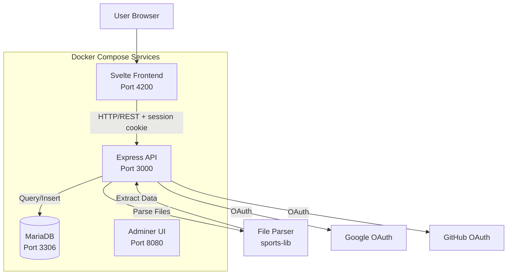
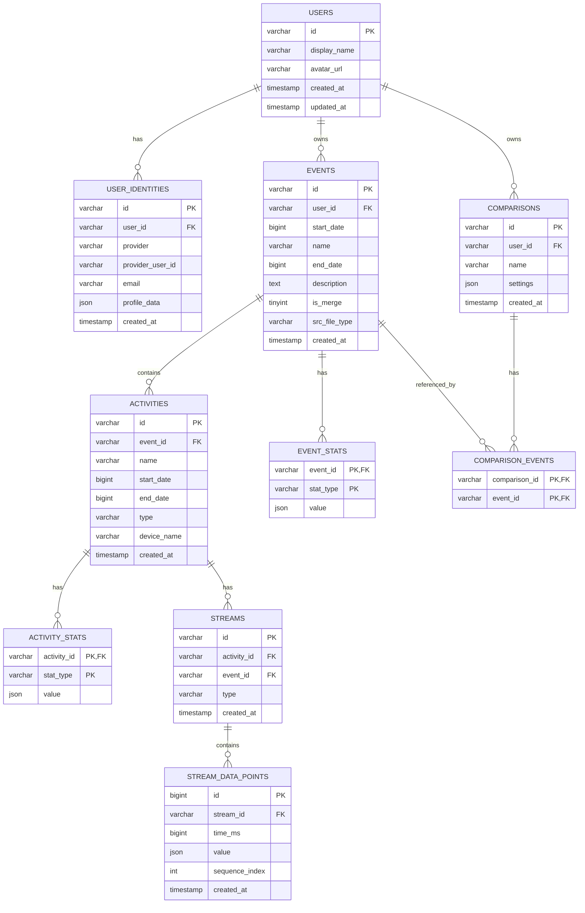
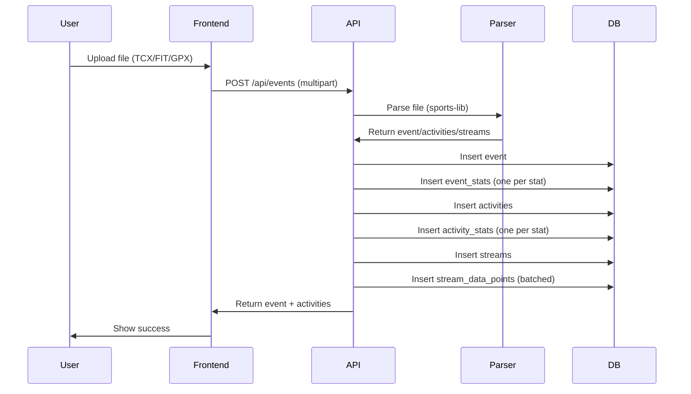
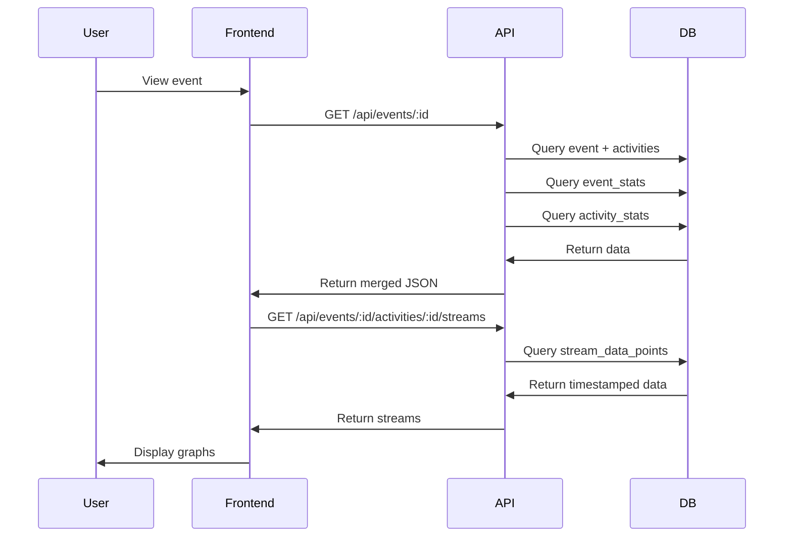

# Architecture Documentation

## System Overview

OpenFitLab is a self-hosted fitness activity tracking platform that allows users to upload activity files, visualize workout data, and compare activities from different fitness trackers.



**Authentication:** Users sign in via Google or GitHub OAuth. The API uses server-side sessions (express-session, MySQL store); the session cookie is HttpOnly and SameSite=Lax. All data endpoints require a valid session and return only the authenticated user's data. Unauthenticated users see the login page; there is no public data.

## Technology Stack

### Backend
- **Runtime**: Node.js 24+
- **Framework**: Express.js 4.x
- **Database**: MariaDB 12.2+ (MySQL compatible)
- **Database Driver**: mysql2 (with promise support)
- **File Parsing**: `@sports-alliance/sports-lib` v6.1.14
- **XML Parsing**: xmldom v0.6.0
- **File Upload**: multer v1.4.5

### Frontend
- **Framework**: Svelte 5
- **Build Tool**: Vite 7
- **Language**: TypeScript 5.9
- **Styling**: Tailwind CSS v4
- **Router**: svelte-spa-router
- **API Client**: `apiFetch()` wrapper (credentials, 401 handling) over native `fetch()`

## Environment Variables

### Frontend (Vite build-time)

| Variable | Required | Default | Description |
|----------|----------|---------|-------------|
| `VITE_UPLOAD_CHUNK_SIZE` | No | 5 | Files per upload batch (1-10) |
| `VITE_GA_ENABLED` | No | false | Enable Google Analytics tracking |
| `VITE_GA_MEASUREMENT_ID` | No | (empty) | GA4 Measurement ID (G-XXXXXXXXXX) |
| `VITE_PRIVACY_EMAIL` | For public instances | (empty) | Contact email shown in the in-app privacy policy (when unset, page shows “Contact email not configured”) |
| `VITE_PRIVACY_REGION` | No | United Kingdom | Geographic region of the data controller as displayed in the privacy policy |
| `VITE_PRIVACY_LAST_UPDATED` | No | (build-time default) | Last update date shown in the privacy policy; set at build time per deployment |

## Database Schema

### Entity Relationship Diagram



All relationships use foreign keys with **ON DELETE CASCADE**. Deleting a **user** cascades to user_identities, events (and their event_stats, activities, activity_stats, streams, stream_data_points), and comparisons (and comparison_event_activities). Deleting an **event**: the event-delete-service first deletes any comparisons that reference the event (in a transaction), then `DELETE FROM events WHERE id = ?`; CASCADE removes event_stats, activities, activity_stats, streams, stream_data_points, and comparison_event_activities. Deleting an activity or stream cascades to their stats and stream_data_points respectively.

### Event vs Activity: Core Concepts

Product definitions: [docs/PRD.md](docs/PRD.md) §10.1 Glossary. Below: technical implementation (tables, relationships).

Understanding the distinction between **Events** and **Activities** is fundamental to the data model:

#### Event
An **Event** is a top-level workout session that represents a single workout file upload. Key characteristics:

- **One file = One event**: When you upload a TCX, FIT, GPX, JSON, or SML file, it creates one event
- **Container for activities**: An event can contain one or more activities
- **Event-level stats**: Aggregated statistics across all activities in the event (e.g., total duration, total distance)
- **Event metadata**: Name (derived from filename), start/end dates, description

#### Activity
An **Activity** is an individual sport segment within an event. Key characteristics:

- **Belongs to an event**: Each activity has an `event_id` foreign key
- **Has a sport type**: Running, Cycling, Swimming, etc.
- **Activity-level stats**: Statistics specific to that activity (e.g., average pace, max heart rate)
- **Owns streams**: All time-series data (heart rate, GPS, cadence, etc.) belongs to activities, not events
- **Can have multiple per event**: Multi-sport events (like triathlons) contain multiple activities

#### Examples

**Single-Sport Workout** (most common):
- **Event**: "Morning Run" (from `morning-run.tcx`)
  - **Activity 1**: Running (type: "Running")
    - Streams: Heart Rate, GPS Position, Cadence, Pace

**Multi-Sport Workout** (triathlon):
- **Event**: "Triathlon Race 2025" (from `triathlon-2025.fit`)
  - **Activity 1**: Swimming (type: "Swimming")
    - Streams: Heart Rate, GPS Position
  - **Activity 2**: Cycling (type: "Cycling")
    - Streams: Heart Rate, GPS Position, Cadence, Power
  - **Activity 3**: Running (type: "Running")
    - Streams: Heart Rate, GPS Position, Cadence, Pace

**Key Relationships**:
- Events have event-level statistics (`event_stats` table)
- Activities have activity-level statistics (`activity_stats` table)
- Streams belong to activities (`streams.activity_id`)
- Stream data points belong to streams (`stream_data_points.stream_id`)

### Table Descriptions

#### users
User accounts. Created on first OAuth login; no email on this table (email lives in user_identities).

- `id`: UUID (VARCHAR(36)) primary key
- `display_name`: Display name from OAuth or user-editable (nullable)
- `avatar_url`: Profile picture URL from provider (nullable)
- `created_at`, `updated_at`: Timestamps

#### user_identities
OAuth provider identities linked to a user. One user can have multiple identities (e.g. Google and GitHub); unique on (provider, provider_user_id).

- `id`: UUID primary key
- `user_id`: FK to users ON DELETE CASCADE
- `provider`: e.g. "google", "github"
- `provider_user_id`: Provider's stable user ID (e.g. OIDC `sub`)
- `email`: Email from provider (nullable)
- `profile_data`: Raw OAuth profile JSON (nullable, for debugging)
- `created_at`: Timestamp

#### sessions
Session store for express-session (express-mysql-session). Session ID, expiry, and serialized session data.

- `session_id`: Primary key
- `expires`: Expiry time (BIGINT)
- `data`: Serialized session (MEDIUMTEXT)
- Index on `expires` for cleanup

#### events
Top-level workout sessions. Each event represents a single workout session and can contain multiple activities. Owned by a user.

- `id`: UUID (VARCHAR(36))
- `user_id`: FK to users ON DELETE CASCADE; all queries scope by this
- `start_date`: Start timestamp in milliseconds (BIGINT)
- `name`: Event name (derived from filename)
- `end_date`: End timestamp (nullable)
- `description`: Event description (nullable)
- `is_merge`: Boolean flag indicating merged events
- `src_file_type`: Source file extension (e.g. "tcx", "fit") (VARCHAR(16), nullable)
- `created_at`: Row creation timestamp

#### event_stats
Relational storage for event-level statistics. One row per stat type.

- `event_id`: Foreign key to events
- `stat_type`: Stat type name (e.g., "Duration", "Distance", "Average Heart Rate")
- `value`: Stat value (JSON, can be number, string, array, or object)
- Primary key: `(event_id, stat_type)`

#### activities
Individual activities within an event. An event can contain multiple activities (e.g., multi-sport events).

- `id`: UUID (VARCHAR(36))
- `event_id`: Foreign key to events
- `name`: Activity name
- `start_date`: Activity start timestamp
- `end_date`: Activity end timestamp
- `type`: Activity type (e.g., "Running", "Cycling", "Swimming")
- `device_name`: Device or tracker name (e.g. "Garmin Forerunner 945") (VARCHAR(255), nullable)
- `created_at`: Row creation timestamp

#### activity_stats
Relational storage for activity-level statistics. One row per stat type.

- `activity_id`: Foreign key to activities
- `stat_type`: Stat type name
- `value`: Stat value (JSON)
- Primary key: `(activity_id, stat_type)`

#### streams
Stream metadata. Each stream represents a time-series data type (heart rate, cadence, pace, elevation, etc.).

- `id`: Composite ID (`{activity_id}_{type}`)
- `activity_id`: Foreign key to activities
- `event_id`: Foreign key to events (denormalized for query efficiency)
- `type`: Stream type (e.g., "Heart Rate", "Cadence", "Pace")
- Unique constraint: `(activity_id, type)`

#### stream_data_points
Timestamped data points for each stream. Stored relationally with timestamps for efficient querying.

- `id`: Auto-increment primary key
- `stream_id`: Foreign key to streams
- `time_ms`: Timestamp in milliseconds (UTC, BIGINT)
- `value`: Data point value (JSON, can be number or object)
- `sequence_index`: Ordering index for data points
- Indexes: `(stream_id, time_ms)`, `stream_id`, `time_ms`

#### comparisons
Saved comparison definitions (optional feature). Owned by a user; per-event activity membership is stored in `comparison_event_activities`, not as JSON.

- `id`: UUID primary key
- `user_id`: FK to users ON DELETE CASCADE; all queries scope by this
- `name`: User-defined name
- `settings`: JSON (e.g. selectedStreams, xAxisMode)
- `created_at`: Row creation timestamp

#### comparison_event_activities
Link table between comparisons, events, and activities. Each comparison can reference one activity per event.

- `comparison_id`: FK to comparisons(id) ON DELETE CASCADE
- `event_id`: FK to events(id) ON DELETE CASCADE
- `activity_id`: FK to activities(id) ON DELETE CASCADE
- Primary key (comparison_id, event_id). Indexes on `event_id` (for “comparisons by event” queries) and `activity_id`.

## API Design

### Authentication and session

- **OAuth:** Google and GitHub. Initiate via `GET /api/auth/google` or `GET /api/auth/github` (redirect to provider). Callbacks at `GET /api/auth/google/callback` and `GET /api/auth/github/callback` create or find the user, create a session, and redirect to the SPA.
- **Account linking:** When a user signs in with a provider they have not used before, if their **verified** email matches an existing identity's email, the new identity is linked to that user so they have one account with multiple sign-in methods. Linking uses verified email only (Google: `email_verified`; GitHub: from profile or `GET /user/emails`). No separate "link account" UI.
- **Session:** express-session with MySQL store; cookie name `ofl.sid`; HttpOnly, Secure in production, SameSite=Lax; 7-day max age. Session holds `userId`.
- **Current user:** `GET /api/auth/me` returns `{ id, displayName, avatarUrl }` or 401. `POST /api/auth/logout` destroys the session.
- **Account:** `GET /api/account/export?includeStreams=true` (optional) returns a JSON archive of the user's data. `DELETE /api/account` deletes the current user's account and all their data (cascades), clears the session cookie; 204 on success, 404 if user not found.
- **Protected routes:** All endpoints under `/api/events`, `/api/comparisons`, `/api/activity-types`, `/api/devices`, and `/api/account` require a valid session. Unauthenticated requests receive 401. All data is scoped by the authenticated user; ownership is enforced (e.g. `WHERE user_id = ?`), and 404 is returned when a resource by ID is not found or not owned.

### Health (no auth)

- **GET /** and **GET /health** – Return `{ ok: true }` for liveness/readiness checks. No authentication required.

### REST Endpoints (data; all require auth and are user-scoped)

#### GET /api/events
List events with optional filtering (current user only).

**Query Parameters:**
- `startDate` (number, optional): Filter events starting from this timestamp
- `endDate` (number, optional): Filter events ending before this timestamp
- `limit` (number, optional): Maximum number of results (default: 50, max: 200)

**Response:**
```json
[
  {
    "id": "uuid",
    "startDate": 1771317117000,
    "name": "Morning Run",
    "endDate": 1771318965000,
    "stats": {
      "Duration": 1848,
      "Distance": 1594,
      "Average Heart Rate": 85
    },
    "srcFileType": "tcx"
  }
]
```

#### GET /api/events/activity-rows
Paginated activity-centric list. Primary endpoint for the dashboard (table with filters and pagination).

**Query Parameters:**
- `limit` (number, optional): Page size
- `offset` (number, optional): Offset for pagination
- `startDate` (number, optional): Filter activities with start_date >= this (ms)
- `endDate` (number, optional): Filter activities with end_date <= this (ms)
- `activityTypes` (string or string[], optional): Filter by activity type
- `devices` (string or string[], optional): Filter by device name
- `search` (string, optional): Search in event/activity names

**Response:**
```json
{
  "rows": [
    { "event": { "id": "uuid", "startDate": 1771317117000, "name": "...", "stats": { ... }, "srcFileType": "tcx" }, "activity": { "id": "uuid", "eventID": "uuid", "type": "Running", "stats": { ... }, "deviceName": "..." } }
  ],
  "total": 42
}
```

#### GET /api/events/:id
Get a single event with all activities.

**Response:**
```json
{
  "event": {
    "id": "uuid",
    "startDate": 1771317117000,
    "name": "Morning Run",
    "stats": { ... },
    "srcFileType": "tcx"
  },
  "activities": [
    {
      "id": "uuid",
      "eventID": "uuid",
      "name": "Running",
      "startDate": 1771317117000,
      "type": "Running",
      "stats": { ... },
      "deviceName": "Garmin Forerunner 945"
    }
  ]
}
```

#### GET /api/events/:id/candidates
Get events that overlap in time with the given event (for comparison candidate picker).

**Response:** Array of event objects with `stats` (same shape as list). 404 if the event `:id` is not found.

#### GET /api/events/:id/activities/:activityId/streams
Get stream data for a specific activity.

**Query Parameters:**
- `types` (string|string[], optional): Filter by stream types

**Response:**
```json
[
  {
    "type": "Heart Rate",
    "data": [
      { "time": 1771317117000, "value": 120 },
      { "time": 1771317118000, "value": 125 },
      ...
    ]
  },
  {
    "type": "Cadence",
    "data": [
      { "time": 1771317117000, "value": 85 },
      ...
    ]
  }
]
```

#### PATCH /api/events/:id/activities/:activityId
Update an activity's type or device name.

**Request:** JSON body with at least one of:
- `type` (string): Activity type (e.g. "Running", "Cycling")
- `deviceName` (string): Device name

**Response:** Updated activity object (same shape as in GET event). 400 if body is empty; 404 if event or activity not found.

#### POST /api/events
Upload and parse multiple files (1–10 per request).

**Request:**
- Content-Type: `multipart/form-data`
- Body: `files` (1–10 files; field name `files`)

**Response:** Always `{ results: BatchResult[] }` — one entry per file, in order. Each element is either:
- Success: `{ success: true, filename: string, id: string, event: EventSummary, activities: Activity[] }`
- Failure: `{ success: false, filename: string, error: string }`

**Process (per file):**
1. Resolve extension from filename; if unsupported, add `{ success: false, filename, error: "Unsupported file type" }` and continue.
2. Parse file using `@sports-alliance/sports-lib`.
3. Extract event, activities, and streams; store in database (events, activities, stats, streams, stream_data_points); discard original file.
4. Add `{ success: true, filename, id, event, activities }` to results. On parse error, add `{ success: false, filename, error: message }`.
5. Return `{ results }`.

#### DELETE /api/events/:id
Delete an event and all related data.

**Response:**
- 204 No Content (success)
- 404 Not Found (event doesn't exist)

**Deletion (in a single transaction):**
1. Find comparisons that reference this event (via comparison_event_activities) and delete those comparisons (CASCADE removes their comparison_event_activities rows).
2. Delete the event; CASCADE then removes event_stats, activities, activity_stats, streams, stream_data_points, and any remaining comparison_event_activities rows.

#### GET /api/activity-types
Returns distinct activity types from the current user's activities. **Response:** JSON array of strings (e.g. `["Running", "Cycling"]`).

#### GET /api/devices
Returns distinct device names from the current user's activities. **Response:** JSON array of strings.

#### Comparisons API

- **GET /api/comparisons** – List saved comparisons. **Response:** Array of `{ id, name, eventIds, activityIds, settings?, createdAt? }`. `eventIds`/`activityIds` are read from `comparison_event_activities`; `createdAt` is milliseconds.
- **GET /api/comparisons/:id** – Get one comparison. **Response:** Same shape. 404 if not found.
- **POST /api/comparisons** – Create comparison. **Body:** `{ name: string, activityIds: string[], settings?: { selectedStreams?, xAxisMode? } }`. **Response:** 201 with created comparison. Backend stores event/activity links in `comparison_event_activities`.
- **POST /api/comparisons/by-events** – Find comparisons linked to any of the given event IDs (e.g. for delete warnings). **Body:** `{ eventIds: string[] }` (non-empty, valid UUIDs). **Response:** Array of `{ id, name, createdAt? }`.
- **DELETE /api/comparisons/:id** – Delete comparison. **Response:** 204 No Content or 404 Not Found.

## Data Flow

### Upload Flow



### Visualization Flow



## Frontend Architecture

### Authentication (frontend)

- **Login:** Route `/#/login` shows "Sign in with Google" and "Sign in with GitHub"; buttons navigate to `GET /api/auth/google` or `GET /api/auth/github` (full redirect). After OAuth callback, user is redirected to `/#/?login=success`.
- **Auth state:** `lib/stores/auth.ts` holds `currentUser`, `authChecked`, `authLoading`; `checkAuth()` calls `GET /api/auth/me` with `credentials: 'include'`. Used on app load.
- **Route guard:** In `App.svelte`, if not `authLoading` and no `currentUser`, the login page is shown; otherwise the router (dashboard, event-detail, comparisons, comparison-view) is rendered. There is no public content; all pages require authentication.
- **API client:** `lib/api/client.ts` provides `apiFetch()`; all API calls use it (or pass `credentials: 'include'`). On 401, auth state is cleared so the user sees the login page. Logout: `POST /api/auth/logout` then clear `currentUser`.
- **User menu:** Sidebar shows avatar (or initials), display name, and logout; optionally "Delete account" (calls `DELETE /api/account`).

### Route → API usage (data flow)

- **Dashboard** (`routes/dashboard.svelte`): Uses `getActivityRows` (GET /api/events/activity-rows) for the table; `getActivityTypes`, `getDevices` for filters (once on mount); `uploadFile` (POST /api/events); `deleteEvent` (DELETE). Single and bulk delete flows call `getComparisonsByEventIds` (POST /api/comparisons/by-events) to warn when comparisons will be removed. List loads when page/filters change (effect); stale responses are ignored via a load generation counter.
- **Event detail** (`routes/event-detail.svelte`): Gets `id` from route params. First `getEvent` (GET /api/events/:id), then when event and selected activity exist, `getStreams` (GET .../streams). Waterfall: event then streams. Uses `getActivityTypes`, `getDevices`, `updateActivity` (PATCH) for inline edit of activity type and device.
- **Comparisons list** (`routes/comparisons.svelte`): `getComparisons` (GET /api/comparisons) on mount; `deleteComparison` (DELETE) for removal.
- **Comparison view** (`routes/comparison-view.svelte`): For `/compare/new?events=id1,id2` uses query event IDs; for `/compare/:id` uses `getComparison` then that comparison’s eventIds. Then `getEvent` per event and `getStreams` per selected activity. Uses `createComparison`, `deleteComparison` for save/delete.

### Component Structure

```
frontend/src/
├── lib/
│   ├── api/
│   │   ├── client.ts          # apiFetch (credentials, 401 handling)
│   │   ├── events.ts          # getEvents, getActivityRows, getEvent, getStreams, uploadFile, deleteEvent, getActivityTypes, getDevices, updateActivity
│   │   ├── comparisons.ts    # getComparisonCandidates, getComparisons, getComparison, getComparisonsByEventIds, createComparison, deleteComparison
│   │   └── index.ts          # Re-exports
│   ├── stores/
│   │   └── auth.ts            # currentUser, checkAuth, logout; consumed by App.svelte
│   ├── types/
│   │   ├── event.ts          # EventSummary, EventDetail, Activity, ActivityRow, StreamData, UploadResponse, Comparison, ComparisonSettings
│   │   └── index.ts
│   ├── utils/                # format-date, activity-icons, stream-config, geo, activity-device, stat-*, chart-utils, dashboard-table-formatters
│   └── components/           # RouteMap, StatCard, TimeSeriesChart, OverlayChart, ComparisonChart, SearchableSelect, Dashboard*, event-detail/*, comparison/*
├── routes/
│   ├── login.svelte           # Sign in with Google / GitHub (redirect to API)
│   ├── dashboard.svelte       # List + upload + bulk actions
│   ├── event-detail.svelte   # Event header, stats, map, stream charts
│   ├── comparisons.svelte     # Saved comparisons list
│   ├── comparison-view.svelte # Compare N events (charts, map, stats)
│   ├── account.svelte         # Export data, delete account
│   └── not-found.svelte       # 404 fallback
├── App.svelte                 # Layout, sidebar, router, auth guard, user menu
└── main.ts                   # Entry point
```

**Testing:** Vitest + jsdom + @testing-library/svelte; setup in `src/test/setup.ts`; fixtures in `src/test/fixtures/`. Test layers: unit (`lib/utils/__tests__/`, `lib/api/__tests__/`), components (`lib/components/__tests__/`), route smoke tests (`routes/__tests__/`).

### Key components and props

- **RouteMap** (`lib/components/RouteMap.svelte`): Either `streams` (single route) or `routes` (array of `{ label, color, streams }` for multi-route). Uses MapLibre + OpenFreeMap; builds GeoJSON via `buildRouteGeoJSON` / `mergeBounds` from `lib/utils/geo.ts`.
- **TimeSeriesChart** / **OverlayChart** / **ComparisonChart**: Take stream data and activity start date (and for ComparisonChart: entries with eventName, color, data, activityStartDate; xAxisMode). Use uPlot; single stream, overlay of multiple streams, or comparison of multiple events.
- **EventDetailStreamCharts**: Receives streams, loading/error state, chartable stream lists, view mode (stacked/overlay), activity selector callbacks.
- **Dashboard**: Table (DashboardActivityTable), filters (DashboardFilters), pagination (DashboardPaginationWithUrl), upload (DashboardUploadSection), toasts, delete flows, compare-candidates flow.

### API layer

- **events.ts**: Fetch-based; all event/activity/stream/meta endpoints. No AbortController in API layer; dashboard uses load generation to ignore stale responses.
- **comparisons.ts**: Fetch-based; comparison CRUD and candidates.
- Types in `lib/types/event.ts`; frontend uses API JSON as-is (no client-side sports-lib).

## Key Architectural Decisions

### 1. File Parsing on Backend
**Decision**: Parse files server-side, not client-side.

**Rationale**: Consistent parsing and validation; handles large files without browser limits. Files are parsed and discarded (no storage).

### 2. Relational Stats Storage
**Decision**: Store statistics in separate tables (`event_stats`, `activity_stats`) with one row per stat type.

**Rationale**: Enables efficient querying and indexing by stat type; easier to extend than JSON blobs.

### 3. Timestamped Stream Data Points
**Decision**: Store stream data points relationally with `time_ms` (BIGINT) timestamps.

**Rationale**: Efficient time-range queries and indexing; enables time-based comparisons; better than JSON arrays.

### 4. No File Storage
**Decision**: Parse files and discard them, don't store originals.

**Rationale**: Reduces storage; all data in DB for regeneration; simpler architecture; users can re-upload.

### 5. No Database Migrations
**Decision**: Schema runs on startup via `initializeSchema()`, no migration system.

**Rationale**: Simpler for self-hosted; schema changes require DB recreate (acceptable); clear versioning via `schema.sql`.

### 6. Self-Hosted Deployment
**Decision**: Docker Compose is the deployment artifact.

**Rationale**: User owns data; no cloud lock-in; one-command deployment on any host with Docker.

## Deployment options

- **Self-hosted**: Docker Compose (default). One command; no cloud account required.
- **Cloud**: Frontend on object storage (S3 or Firebase Hosting), API on small or serverless compute (App Runner, Cloud Run), database as a managed service (RDS, Cloud SQL). Single domain with path-based routing so the app keeps calling `/api` (same-origin). No load balancer required when using CloudFront (AWS) or Firebase Hosting / single Cloud Run (GCP).

See [docs/HOSTING.md](HOSTING.md) for detailed AWS and GCP plans, cost estimates, and a production checklist.

## Security Considerations

- **Authentication**: OAuth (Google, GitHub) with server-side session cookies. Session is HttpOnly, Secure in production, SameSite=Lax. No tokens in localStorage; XSS cannot steal session. **CSRF protection**: session-based CSRF tokens via @dr.pogodin/csurf; token is returned in GET /api/auth/me and must be sent in the `CSRF-Token` (or `X-CSRF-Token`) header for all state-changing requests (POST, PATCH, PUT, DELETE).
- **Authorization**: Every request to data endpoints is scoped by `req.userId`; repositories filter by `user_id`. Access by ID returns 404 when resource is not owned (no 403 to avoid leaking existence).
- **CORS**: Restricted to configured origin in production; dev may allow localhost. Same-origin deployment (frontend and API on one domain) is recommended so cookies work without CORS.
- **Rate limiting**: Applied to auth routes (login initiation and callbacks), uploads, and global API to limit abuse.
- **Secure headers**: Helmet middleware (CSP, HSTS, X-Content-Type-Options, etc.). CSP allows self, inline styles (Tailwind), and HTTPS images (OAuth avatars).
- **File upload**: Limited to supported formats (TCX, FIT, GPX, JSON, SML); multer file size limit (e.g. 50 MB). Files parsed and discarded.
- **SQL injection**: Parameterized queries via mysql2.
- **Secrets**: SESSION_SECRET required (no default); OAuth client ID/secret and callback URL from environment. No secrets in logs.
- **CI security checks:**
  - Dependabot: automated dependency vulnerability alerts and PRs
  - npm audit: run in CI for both backend and frontend (warn-only)
  - dependency-review-action: fails PRs that introduce new vulnerable dependencies (HIGH/CRITICAL)
  - Gitleaks: secrets scanning on PR diffs and weekly full-history
  - GitHub push protection: blocks pushes containing known secret patterns
  - Semgrep: SAST with Node.js/JavaScript/TypeScript rulesets on every PR
  - eslint-plugin-security: security-focused lint rules in backend ESLint
  - Trivy: Dockerfile and docker-compose misconfiguration scanning
  - Docker image scanning: deferred until the project builds its own production images

## Performance Considerations

- **Database Indexes**: Indexes on foreign keys and time ranges
- **Batch Inserts**: Stream data points inserted in batches of 1000
- **Connection Pooling**: MySQL connection pool (limit: 10)
- **JSON Parsing**: Handles both object and string JSON from database
- **Query Optimization**: Uses `IN` clauses for batch stat loading

## Future Enhancements

- Account linking (automatic by verified email) — implemented; see **Authentication and session** above.
- Advanced analytics and correlation analysis
- Additional file format support
- Mobile app support
- Real-time data sync from fitness trackers
