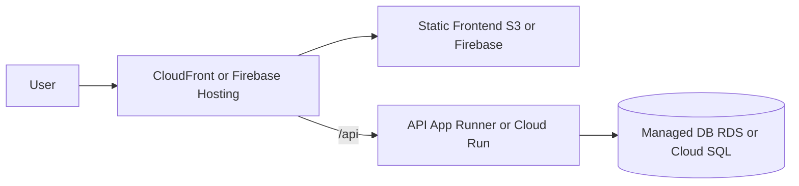

# Hosting Guide

This guide describes how to run OpenFitLab in the cloud with a managed database, static frontend hosting, and a small or serverless API. It is designed to be **cost-effective and scalable**, starting from the smallest instance sizes and avoiding load balancers where possible.

**Self-hosted (Docker Compose)** remains the default: one command, no cloud account, full control. Use this guide when you want to deploy on **AWS** or **Google Cloud** with managed services.

---

## Architecture overview

When deploying to the cloud:

- **Database**: Managed MySQL/MariaDB (RDS on AWS, Cloud SQL on GCP). No self-managed DB server.
- **Frontend**: Static files (build output from `frontend/dist/`) served from object storage (S3 or Firebase Hosting) or from the same app as the API.
- **Backend**: Node.js API run as a container on App Runner (AWS) or Cloud Run (GCP). Scale to zero or smallest instance to minimize cost.
- **Routing**: Single domain with path-based routing so the frontend can call `/api` (same-origin). We avoid dedicated load balancers (ALB, GCP HTTP(S) LB) to save ~\$16–20/month.

---

## Avoiding load balancers

Load balancers (ALB on AWS, HTTP(S) Load Balancer on GCP) add roughly **\$16–20/month** fixed cost. To avoid them:

- **AWS**: Use **CloudFront as the only entry point**. CloudFront supports multiple origins and path-based behaviors: default origin = S3 (static), path `/api/*` → App Runner. No ALB. Use **App Runner** (not Fargate) so CloudFront can point directly at the service URL.
- **GCP**: Use **Firebase Hosting** to serve the static site and **rewrite** `/api/*` to the Cloud Run URL. Same domain, no GCP HTTP(S) Load Balancer. Alternatively, run **one Cloud Run service** that serves both the SPA and the API (single container, single URL).

The plans below use these no–load-balancer options as the default. Alternatives that use a load balancer are noted where relevant.

---

## AWS hosting plan

| Component            | Service                                      | Notes |
|----------------------|----------------------------------------------|-------|
| **Database**         | **RDS for MySQL** (or MariaDB if available) | Smallest: **db.t4g.micro** (1 vCPU, 1 GB RAM). Single-AZ to minimize cost. Aurora Serverless v2 (min 0.5 ACU) if you need serverless scaling. |
| **Frontend**         | **S3** + **CloudFront**                      | Build `frontend/dist/` and upload to an S3 bucket. Use CloudFront as the origin for HTTPS and caching. |
| **Backend**          | **AWS App Runner**                           | Run the API from an ECR image (0.25 vCPU, 0.5 GB minimum). App Runner exposes a URL; no ALB needed. Use **Secrets Manager** or **Parameter Store** for `DB_HOST`, `DB_USER`, `DB_PASSWORD`, `DB_DATABASE`. |
| **Routing**          | **CloudFront only**                          | Two origins: (1) S3 for default (static), (2) App Runner for path `/api/*`. Path-based cache behavior routes `/api` to App Runner; everything else to S3. Single domain, same-origin — frontend keeps `API_BASE = '/api'`. |

**If you use Fargate instead of App Runner**: you must put the service behind an ALB or NLB (~\$16–20/month), so total cost increases. For lowest cost, prefer App Runner + CloudFront only.

### AWS monthly cost estimate (minimal, US region, ~2024–2025)

- **RDS db.t4g.micro**: ~\$22/month (single-AZ, on-demand). Aurora Serverless v2 (min 0.5 ACU): ~\$43–54/month + storage.
- **S3 + CloudFront** (static + path-based routing to App Runner): ~\$1–5/month for low traffic (CloudFront free tier: 2M requests, 1 TB out).
- **App Runner** (API): ~\$5–15/month for light use (or \$0 if service is paused).
- **Rough total (no LB)**: **~\$28–42/month**. Lower if App Runner is paused when idle.

---

## GCP hosting plan

| Component            | Service                         | Notes |
|----------------------|---------------------------------|-------|
| **Database**         | **Cloud SQL for MySQL**         | Smallest shared-core instance (e.g. 1 vCPU, 614 MB–3.75 GB). MySQL 8 compatible with current MariaDB usage. |
| **Frontend**         | **Firebase Hosting** (recommended) | Upload `frontend/dist/` and configure a **rewrite** so `/api/*` goes to your Cloud Run URL. Same domain, HTTPS, same-origin. Free tier: 10 GB storage, 360 MB/day. Alternative: GCS + HTTP(S) Load Balancer (~\$18/month for the LB) if you prefer to stay off Firebase. |
| **Backend**          | **Cloud Run**                   | Run the API as a container (Dockerfile). Smallest: 0.08 vCPU, 128–256 MiB. Scale to zero when idle. Set env or **Secret Manager** for `DB_HOST`, `DB_USER`, `DB_PASSWORD`, `DB_DATABASE`. |
| **Routing**          | **Firebase Hosting rewrites**   | No GCP HTTP(S) Load Balancer. Firebase Hosting serves static and rewrites `/api/*` to Cloud Run. |

**Alternative — single Cloud Run service**: Serve both the SPA and the API from one Cloud Run service (e.g. Express serves `dist/` for `/` and mounts the API at `/api`). One container, one URL; no Firebase, no GCS, no load balancer. Slightly more app work (e.g. copy `frontend/dist` into the API image and add static middleware).

### GCP monthly cost estimate (minimal, US region, ~2024–2025)

- **Cloud SQL** (smallest shared-core): ~\$10–25/month depending on region and tier.
- **Firebase Hosting** (static + rewrites): **\$0** within free tier (10 GB storage, 360 MB/day).
- **Cloud Run** (0.08 vCPU, 256 MiB, scale-to-zero): ~\$0–2/month for low traffic (free tier: 2M requests/month).
- **Rough total (no LB)**: **~\$10–27/month** (Cloud SQL + Firebase + Cloud Run).
- *Single Cloud Run service*: ~\$10–27/month (Cloud SQL + Cloud Run only).
- *If you use GCS + HTTP(S) LB*: add ~\$18/month for the LB; total ~\$30–50/month.

---

## Production checklist

Before going live on any cloud setup:

1. **Environment variables / secrets**
   - Backend: `DB_HOST`, `DB_USER`, `DB_PASSWORD`, `DB_DATABASE`. Use the managed DB endpoint and credentials. Prefer secret stores (Secrets Manager, Parameter Store, Secret Manager) over plain env in production.
   - Frontend: No change needed if you use same-origin `/api`; if you ever use a different API origin, add a build-time env (e.g. `VITE_API_BASE`) and use it in the API client.

2. **CORS**
   - Restrict CORS in the API to your frontend origin (e.g. `https://your-domain.com`). Do not allow `*` in production.

3. **HTTPS**
   - Use CloudFront (AWS) or Firebase Hosting / Cloud Run (GCP) with HTTPS. Custom domain: attach your certificate in the respective console.

4. **API Dockerfile**
   - The repo currently runs the API via Docker Compose with a mounted volume. For cloud, build a **production Dockerfile** in `backend/` (multi-stage: install deps, run `node src/index.js`), push to ECR (AWS) or Artifact Registry (GCP), and deploy that image to App Runner or Cloud Run.

5. **Adminer**
   - Do not expose Adminer on the public internet. Omit it from cloud deployment or run it only from a secure dev/bastion with access to the managed DB.

6. **File upload limits**
   - Ensure your API platform allows sufficient request body size for file uploads (App Runner and Cloud Run support configurable limits).

---

## Summary

| Option              | Database   | Frontend        | Backend     | Routing / LB      | Est. monthly (minimal) |
|---------------------|------------|-----------------|-------------|-------------------|-------------------------|
| **AWS (no LB)**     | RDS db.t4g.micro | S3 + CloudFront | App Runner  | CloudFront only   | ~\$28–42                |
| **GCP (no LB)**     | Cloud SQL  | Firebase Hosting| Cloud Run   | Firebase rewrites | ~\$10–27                |
| **GCP single Run**  | Cloud SQL  | (in same service) | Cloud Run | —                 | ~\$10–27                |

Prices are approximate, US region, and can change. Use the official [AWS Pricing Calculator](https://calculator.aws/) and [Google Cloud Pricing Calculator](https://cloud.google.com/products/calculator) for up-to-date estimates.
