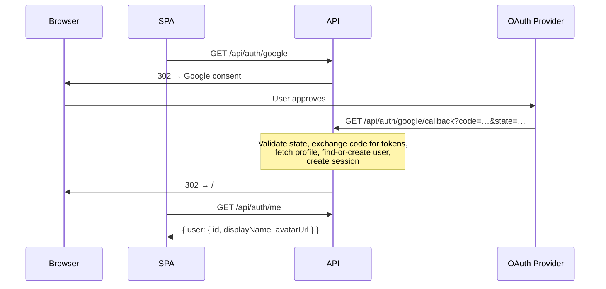

# Authentication & Multi-User Architecture Plan for OpenFitLab

## 1. Recommended Architecture

**Backend-managed OAuth (OIDC) with server-side session cookies** using [Passport.js](http://www.passportjs.org/) strategies and [express-session](https://github.com/expressjs/session) backed by the existing MariaDB.

### Why this approach over the alternatives

| Criterion | Backend OAuth + Session Cookies ✅ | Backend OAuth + JWTs | Self-hosted IdP (Keycloak/Authentik) |
|---|---|---|---|
| **Security (public hosting)** | Session token is `HttpOnly`, `Secure`, `SameSite=Lax` — immune to XSS token theft. CSRF mitigated by SameSite + double-submit token. | JWT in `localStorage` = XSS-stealable. Cookie-JWT recreates sessions with extra complexity. | Strong, but IdP itself is a high-value attack surface. Needs its own hardening, TLS, updates. |
| **Implementation complexity** | ~300 LOC of auth middleware + 2 Passport strategies. Well-understood, battle-tested. | Similar callback code but adds JWT signing/refresh/revocation complexity (stateful revocation negates the "stateless" benefit). | Add a full Java/Go service (~1 GB RAM), configure realms/clients, learn admin API. Far more moving parts. |
| **SPA integration** | Cookies are automatic (`credentials: 'include'` on fetch). SPA checks `GET /api/auth/me` on load. Simple. | Must manually attach `Authorization: Bearer …` header. Refresh token rotation logic in SPA. | Redirects through IdP login page. JS OIDC client library required. More complex callback dance. |
| **Local dev (Docker Compose)** | Add a `sessions` table, done. Same MariaDB. | Same. | Add Keycloak/Authentik container (1+ GB RAM), configure realm, create client. Slow cold start. |
| **Scalability / extensibility** | Session store is MariaDB (already have it). Add Redis later if needed. Adding providers = one more Passport strategy. | Stateless is a theoretical advantage but in practice you need a revocation list anyway. | Most extensible *in theory* (RBAC, MFA, SAML) but massive overkill without admin users or enterprise SSO needs. |
| **Maintenance** | Passport is mature, minimal updates. `express-session` is stable. | JWT libraries need careful dependency management. Key rotation is your problem. | IdP needs its own version upgrades, DB, backup strategy. Effectively doubles your ops burden. |

**Verdict:** For a no-admin, self-hosted fitness app with 2-4 OAuth providers and no enterprise SSO needs, backend-managed sessions are the simplest, most secure, and most maintainable choice. A self-hosted IdP would be justified if you later need RBAC, MFA, or SAML — and can be added *on top of* this foundation by making the backend a relying party to the IdP.

### Recommended OAuth Providers

| Provider | Why |
|---|---|
| **Google** | Largest user base, reliable OIDC |
| **GitHub** | Developer-friendly, common in self-hosted tools |
| **Apple** (optional, Stage 5+) | Required for iOS apps, good privacy story |
| **Discord** (optional) | Popular in gaming/fitness communities |

> [!NOTE]
> Start with Google + GitHub. Additional providers are identical in structure (one Passport strategy + one row in `OAUTH_PROVIDERS` config per provider).

---

## 2. Identity Model and Database Changes

### 2.1 New Tables

#### `users`

```sql
CREATE TABLE IF NOT EXISTS users (
  id VARCHAR(36) PRIMARY KEY,              -- UUIDv4
  display_name VARCHAR(255) NULL,          -- From OAuth profile, user-editable
  avatar_url VARCHAR(2048) NULL,           -- Profile picture URL from provider
  created_at TIMESTAMP DEFAULT CURRENT_TIMESTAMP,
  updated_at TIMESTAMP DEFAULT CURRENT_TIMESTAMP ON UPDATE CURRENT_TIMESTAMP
);
```

**Design decisions:**
- **No email column on `users`.** Email lives only in `user_identities` because: (a) not all providers guarantee email, (b) email can change at the provider, (c) storing it once per identity avoids sync issues. If you need a "contact email" later, add it as an explicit user preference.
- **No `is_admin` or `role` column.** Per requirements, no admin concept.
- **`display_name`** is nullable because some providers may not provide it. Defaults to provider profile name on first login; user can change it later.

#### `user_identities`

```sql
CREATE TABLE IF NOT EXISTS user_identities (
  id VARCHAR(36) PRIMARY KEY,              -- UUIDv4
  user_id VARCHAR(36) NOT NULL,
  provider VARCHAR(32) NOT NULL,           -- 'google', 'github'
  provider_user_id VARCHAR(255) NOT NULL,  -- `sub` claim (Google) or numeric ID (GitHub)
  email VARCHAR(255) NULL,                 -- As provided by the OAuth profile (may be null)
  profile_data JSON NULL,                  -- Raw profile snapshot (for debugging, optional)
  created_at TIMESTAMP DEFAULT CURRENT_TIMESTAMP,
  UNIQUE KEY uk_provider_identity (provider, provider_user_id),
  INDEX idx_user_id (user_id),
  CONSTRAINT fk_identity_user FOREIGN KEY (user_id) REFERENCES users (id) ON DELETE CASCADE
);
```

**Design decisions:**
- **`provider` + `provider_user_id` is the unique compound key** that identifies an OAuth account. This is the stable identifier; emails can change.
- **Separate table from `users`** allows linking multiple providers to one user (account linking).
- **`profile_data`** stores the raw OIDC profile JSON. Useful for debugging but never used for authorization. Can be nulled after first login if privacy is a concern.
- **ON DELETE CASCADE** from `users` — deleting a user removes all their identities.

#### `sessions` (for `express-session`)

```sql
CREATE TABLE IF NOT EXISTS sessions (
  session_id VARCHAR(128) PRIMARY KEY,
  expires BIGINT UNSIGNED NOT NULL,
  data MEDIUMTEXT,
  INDEX idx_expires (expires)
);
```

This table is managed by [express-mysql-session](https://github.com/chill117/express-mysql-session). The schema is standard; the library creates it automatically but we include it in [schema.sql](file:///home/luis/Projects/OpenFitLab/backend/sql/schema.sql) for documentation.

### 2.2 Account Linking Strategy (Staged)

**Stage 1 (launch):** No automatic account linking. Each OAuth login creates a new user. If someone logs in with Google and then with GitHub, they get two separate accounts.

**Stage 2 (future):** Add a "Link another account" flow in user settings. When a logged-in user initiates linking:
1. They authenticate with the new provider.
2. Backend checks that this provider identity isn't already linked to *another* user.
3. If clean, insert a new `user_identities` row pointing to the existing `user_id`.

**Why staged:** Automatic email-based linking (matching on email across providers) is a security risk if a provider doesn't verify email, as an attacker can claim any email on a less-trusted provider.

### 2.3 Per-User Namespacing

#### Tables requiring `user_id`

| Table | Add `user_id`? | Rationale |
|---|---|---|
| `events` | **Yes** | Primary data ownership anchor. All child data (activities, stats, streams) inherits ownership through FK chains. |
| `comparisons` | **Yes** | Comparisons are user-owned. A user's comparison can only reference their own events. |
| `event_stats` | No | Owned via FK to `events`. Isolation inherited. |
| `activities` | No | Owned via FK to `events`. Isolation inherited. |
| `activity_stats` | No | Owned via FK to `activities`. Isolation inherited. |
| `streams` | No | Owned via FK to `activities` + `events`. Isolation inherited. |
| `stream_data_points` | No | Owned via FK to `streams`. Isolation inherited. |
| `comparison_events` | No | Owned via FK to `comparisons`. Isolation inherited; enforcement at comparison creation ensures event ownership. |

> [!IMPORTANT]
> Only `events` and `comparisons` get a `user_id` column. All child data is implicitly scoped through the FK chain. This minimizes schema changes while maintaining full isolation.

#### Schema changes to existing tables

```sql
-- events: add user_id column
ALTER TABLE events ADD COLUMN user_id VARCHAR(36) NOT NULL AFTER id;
ALTER TABLE events ADD INDEX idx_user_id (user_id);
ALTER TABLE events ADD INDEX idx_user_start_date (user_id, start_date);
ALTER TABLE events ADD CONSTRAINT fk_events_user FOREIGN KEY (user_id) REFERENCES users (id) ON DELETE CASCADE;

-- comparisons: add user_id column
ALTER TABLE comparisons ADD COLUMN user_id VARCHAR(36) NOT NULL AFTER id;
ALTER TABLE comparisons ADD INDEX idx_user_id (user_id);
ALTER TABLE comparisons ADD INDEX idx_user_created_at (user_id, created_at);
ALTER TABLE comparisons ADD CONSTRAINT fk_comparisons_user FOREIGN KEY (user_id) REFERENCES users (id) ON DELETE CASCADE;
```

Since the app uses `CREATE TABLE IF NOT EXISTS` on startup (no migrations), these changes will be applied directly to [schema.sql](file:///home/luis/Projects/OpenFitLab/backend/sql/schema.sql). **This is a breaking change requiring DB recreation.** See §2.5 below.

#### Index changes

| Table | New Index | Purpose |
|---|---|---|
| `events` | [(user_id, start_date)](file:///home/luis/Projects/OpenFitLab/backend/src/index.js#48-59) | All list queries filter by user_id first, then sort by start_date. Composite index serves both. |
| `events` | [(user_id)](file:///home/luis/Projects/OpenFitLab/backend/src/index.js#48-59) | Simple user-scoped lookups. |
| `comparisons` | [(user_id, created_at)](file:///home/luis/Projects/OpenFitLab/backend/src/index.js#48-59) | List comparisons by user, ordered by creation. |
| `comparisons` | [(user_id)](file:///home/luis/Projects/OpenFitLab/backend/src/index.js#48-59) | Simple user-scoped lookups. |
| `activities` | Existing [(event_id, type, device_name, start_date)](file:///home/luis/Projects/OpenFitLab/backend/src/index.js#48-59) remains adequate — queries always resolve event_id first.  | No change needed. |

#### Cascade delete behavior

```
User deleted (users)
  └─→ user_identities rows (CASCADE)
  └─→ events rows (CASCADE)
  │     └─→ event_stats (CASCADE)
  │     └─→ activities (CASCADE)
  │     │     └─→ activity_stats (CASCADE)
  │     │     └─→ streams (CASCADE)
  │     │           └─→ stream_data_points (CASCADE)
  │     └─→ comparison_events for those events (CASCADE)
  └─→ comparisons rows (CASCADE)
  │     └─→ comparison_events for those comparisons (CASCADE)
  └─→ sessions rows (application logic, not FK)
```

**One `DELETE FROM users WHERE id = ?` cascades everything.** Sessions must be cleared separately (application logic invalidates sessions by user_id before or after deletion).

### 2.4 Data Export (Minimal Viable)

Add a single endpoint: **`GET /api/account/export`** that returns a JSON archive of all user data:
- User profile (display_name, identities minus `profile_data`)
- Events with their stats
- Activities with their stats
- Comparisons with settings
- Stream metadata (but **not** raw `stream_data_points` by default — too large; offer a `?includeStreams=true` option)

This satisfies GDPR "right to data portability" at a minimal implementation cost.

### 2.5 Schema Migration Strategy

> [!IMPORTANT]
> **Accept the breaking change.** This is the right call for this project.

**Rationale:**
- The app has no migration framework and adding one solely for this change would cost more effort than it saves.
- This is a fundamental architectural change (adding user ownership to all data). There is no meaningful "migration" of existing data because there are no users to assign it to.
- The existing `CREATE TABLE IF NOT EXISTS` pattern means the new schema simply replaces the old one on a fresh DB.
- Self-hosted users with existing data can back up, recreate DB, and re-upload their files (files are the source of truth, not the DB).

**Documentation:** Add a `BREAKING_CHANGES.md` or a section in the release notes explaining:
1. This version requires a fresh database.
2. Users should export/back up any important data before upgrading.
3. `docker compose down -v && docker compose up -d` will start fresh.

---

## 3. Backend API and Middleware Changes

### 3.1 New Auth Endpoints

| Method | Path | Purpose |
|---|---|---|
| `GET` | `/api/auth/google` | Redirect to Google OAuth consent screen |
| `GET` | `/api/auth/google/callback` | Google OAuth callback → create/find user → set session → redirect to SPA |
| `GET` | `/api/auth/github` | Redirect to GitHub OAuth consent screen |
| `GET` | `/api/auth/github/callback` | GitHub OAuth callback → create/find user → set session → redirect to SPA |
| `GET` | `/api/auth/me` | Return current user (from session) or 401 |
| `POST` | `/api/auth/logout` | Destroy session, clear cookie |
| `DELETE` | `/api/account` | Delete user account and all data |
| `GET` | `/api/account/export` | Export all user data as JSON |

**Auth callback flow:**



### 3.2 Session Configuration

```js
// backend/src/middleware/session.js
const session = require('express-session');
const MySQLStore = require('express-mysql-session')(session);

const sessionMiddleware = session({
  secret: process.env.SESSION_SECRET, // Required, no default
  store: new MySQLStore({ /* use existing DB pool */ }),
  resave: false,
  saveUninitialized: false,
  name: 'ofl.sid',                    // Not the default 'connect.sid'
  cookie: {
    httpOnly: true,
    secure: process.env.NODE_ENV === 'production',
    sameSite: 'lax',
    maxAge: 7 * 24 * 60 * 60 * 1000,  // 7 days
    path: '/',
  },
});
```

### 3.3 Authentication Middleware

```js
// backend/src/middleware/require-auth.js
function requireAuth(req, res, next) {
  if (!req.session?.userId) {
    return res.status(401).json({ error: 'Authentication required' });
  }
  // Attach user context for downstream use
  req.userId = req.session.userId;
  next();
}
```

**Application in [index.js](file:///home/luis/Projects/OpenFitLab/backend/src/index.js):**
```js
// Public routes (no auth)
app.get('/', ...);
app.get('/health', ...);
app.use('/api/auth', authRouter);

// Protected routes (require auth)
app.use('/api/events', requireAuth, eventsRouter);
app.use('/api/comparisons', requireAuth, comparisonsRouter);
app.use('/api', requireAuth, metaRouter);
app.use('/api/account', requireAuth, accountRouter);
```

### 3.4 User-Scoping Strategy Across All Queries

The scoping strategy adds `userId` to every service call, which flows down to repositories. **The `userId` comes from `req.userId` (set by `requireAuth` middleware), never from request body or URL params.**

#### Pattern: Route → Service → Repository

```
Route handler:
  const result = await listEvents({ ...filters }, { userId: req.userId });
                                                     ^^^^^^^^^^^^^^^^^^^^^^
Service:
  async function listEvents(filters, opts = {}) {
    // opts.userId is always present (from middleware)
    const rows = await eventRepository.findMany(filters, opts);
    ...
  }

Repository:
  async function findMany(filters, opts = {}) {
    let sql = `SELECT ... FROM events WHERE user_id = ?`;
    const params = [opts.userId];          // ← Always first filter
    ...
  }
```

#### Specific endpoint scoping

| Endpoint | Scoping Change |
|---|---|
| `GET /api/events` | `WHERE user_id = ?` added to `eventRepository.findMany` |
| `GET /api/events/activity-rows` | `WHERE e.user_id = ?` added to `activityRepository.getActivityRowPairs` base query |
| `GET /api/events/:id` | `WHERE id = ? AND user_id = ?` in `eventRepository.findById` — returns 404 if not owned |
| `POST /api/events` | `eventRepository.insertEvent` receives `user_id` from `req.userId` |
| `DELETE /api/events/:id` | `WHERE id = ? AND user_id = ?` in `eventRepository.deleteById` |
| `GET /api/events/:id/candidates` | Source event lookup includes `user_id`; candidate query includes `AND user_id = ?` |
| `GET /api/events/:id/activities/:activityId/streams` | Event ownership checked first (`AND user_id = ?`), then activity lookup via event_id FK chain |
| `PATCH /api/events/:id/activities/:activityId` | Event ownership checked first |
| `GET /api/activity-types` | `WHERE user_id = ?` via JOIN to events (or denormalize — see below) |
| `GET /api/devices` | Same as activity-types |
| `GET /api/comparisons` | `WHERE user_id = ?` |
| `GET /api/comparisons/:id` | `WHERE id = ? AND user_id = ?` |
| `POST /api/comparisons` | `user_id` from `req.userId`; verify all `eventIds` belong to user |
| `DELETE /api/comparisons/:id` | `WHERE id = ? AND user_id = ?` |
| `POST /api/comparisons/by-events` | Verify all eventIds belong to user, then query |

#### IDOR Prevention

**Rule:** Every resource access by ID must include `AND user_id = ?` in the query. If the query returns no rows, return 404 (not 403) to avoid confirming that no such resource exists.

For nested resources (activities, streams), ownership is verified by checking the parent event's `user_id`. The activity/stream queries join through `event_id`, and the event lookup includes the `user_id` predicate.

**For `GET /api/activity-types` and `GET /api/devices`:**
These currently run `SELECT DISTINCT type FROM activities` globally. With multi-user, they must be scoped:
```sql
SELECT DISTINCT a.type
FROM activities a
JOIN events e ON a.event_id = e.id
WHERE e.user_id = ?
```

### 3.5 Rate Limiting

Install [express-rate-limit](https://github.com/express-rate-limit/express-rate-limit):

| Scope | Window | Max | Notes |
|---|---|---|---|
| `GET /api/auth/*` (login initiation) | 15 min | 10 | Prevent OAuth redirect abuse |
| `GET /api/auth/*/callback` | 15 min | 20 | Higher because redirects are automated |
| `POST /api/events` (upload) | 15 min | 30 | Prevent upload flood |
| Global API | 1 min | 100 | General abuse prevention |

### 3.6 Abuse Controls

| Control | Implementation |
|---|---|
| **Upload file size** | Already 50 MB via multer. Reasonable. |
| **Upload file type** | Already validated by `FileParser.getExtension()`. Whitelist: `tcx`, `fit`, `gpx`, `json`, `sml`. |
| **Request body size** | Already `express.json({ limit: '1mb' })`. Sufficient. |
| **Max events per user** | Optional: add a check in upload service. Start with 10,000 as a soft limit. |
| **Max comparisons per user** | Optional: 1,000 soft limit. |

### 3.7 Logging Strategy

- **Do log:** user_id, request method/path, response status, timestamp, IP (for abuse detection).
- **Do NOT log:** session tokens, OAuth access/refresh tokens, `authorization` headers, `profile_data` from OIDC.
- **Sanitize:** If using a request logger (e.g., Morgan), use a custom format that excludes cookie headers.
- **File upload logs:** Log filename, size, and extension. Do not log file contents.

---

## 4. Frontend Login Flow and Route Protection

### 4.1 Sign-In Page

Create a new route at `/#/login` that renders:
- App branding / logo
- "Sign in with Google" button → navigates to `GET /api/auth/google`
- "Sign in with GitHub" button → navigates to `GET /api/auth/github`
- No form fields (no username/password)

These are **full-page navigations** (not fetch calls), because OAuth requires browser redirects through the provider's consent screen.

### 4.2 Auth State Management

```typescript
// frontend/src/lib/stores/auth.ts
interface AuthUser {
  id: string;
  displayName: string | null;
  avatarUrl: string | null;
}

// Svelte 5 runes-based state
let currentUser = $state<AuthUser | null>(null);
let authChecked = $state(false);  // Has the initial /api/auth/me check completed?
let authLoading = $state(true);

async function checkAuth(): Promise<void> {
  try {
    const response = await fetch('/api/auth/me', { credentials: 'include' });
    if (response.ok) {
      currentUser = await response.json();
    } else {
      currentUser = null;
    }
  } catch {
    currentUser = null;
  } finally {
    authChecked = true;
    authLoading = false;
  }
}
```

**On SPA load ([App.svelte](file:///home/luis/Projects/OpenFitLab/frontend/src/App.svelte)):** Call `checkAuth()`. While `authLoading` is true, show a loading spinner. Once resolved, render the app or redirect to login.

### 4.3 Session Persistence

**Approach: HttpOnly session cookies (set by Express).**

- The SPA never touches tokens directly. The browser automatically sends the session cookie on every `/api` request.
- **No `localStorage`/`sessionStorage` for auth tokens.** This is the primary XSS defense.
- SPA simply calls `fetch('/api/auth/me', { credentials: 'include' })` to check session validity.
- `credentials: 'include'` is needed because in production the SPA and API may be served from the same origin (recommended) or different origins (CORS config required).

### 4.4 Route Guarding

In [App.svelte](file:///home/luis/Projects/OpenFitLab/frontend/src/App.svelte), wrap the router:

```svelte
{#if authLoading}
  <LoadingSpinner />
{:else if !currentUser}
  <LoginPage />
{:else}
  <Router {routes} />
{/if}
```

This is simpler and more secure than per-route guards because there is **no public content** in this app — every page requires authentication.

### 4.5 Global 401/403 Handling

Create a fetch wrapper or interceptor:

```typescript
// frontend/src/lib/api/client.ts
export async function apiFetch(url: string, opts?: RequestInit): Promise<Response> {
  const response = await fetch(url, { ...opts, credentials: 'include' });
  if (response.status === 401) {
    // Session expired — redirect to login
    currentUser = null;
    return response;
  }
  return response;
}
```

All API modules ([events.ts](file:///home/luis/Projects/OpenFitLab/frontend/src/lib/api/events.ts), `comparisons.ts`) switch from raw `fetch()` to `apiFetch()`.

### 4.6 Logout Flow

1. SPA calls `POST /api/auth/logout` (with `credentials: 'include'`).
2. Backend destroys the session, clears the cookie.
3. SPA sets `currentUser = null`, which triggers the auth guard to show the login page.

### 4.7 User Profile in Sidebar

Add a small user section at the bottom of the sidebar (above the collapse toggle):
- Avatar image (from `avatarUrl`) or initials fallback
- Display name
- Logout button
- "Delete account" in settings (future)

---

## 5. Security Checklist

### 5.1 CSRF Protection

- **Primary defense:** `SameSite=Lax` cookies. Lax prevents cookies from being sent on cross-origin POST requests (the main CSRF vector).
- **Secondary defense:** For state-changing POST/DELETE/PATCH requests, verify the `Origin` header matches the expected origin. This is a lightweight alternative to CSRF tokens.
- **No CSRF token needed** because: `SameSite=Lax` blocks cross-origin POST with cookies; the API uses JSON (`Content-Type: application/json`) which can't be constructed from a plain HTML form; the OAuth state parameter prevents login CSRF.

### 5.2 XSS and Token Storage

- Session token is in an `HttpOnly` cookie → **not accessible to JavaScript**.
- No tokens in `localStorage` or `sessionStorage`.
- Frontend uses Svelte's built-in escaping (no `{@html}` with user content).
- CSP header restricts inline scripts (see §5.6).

### 5.3 CORS and SameSite

**Production (recommended: same origin):**
- Serve frontend static files through the API (or via a reverse proxy like Caddy/nginx that routes `/api` to Express and `/` to the SPA).
- CORS is not needed (same origin). Remove `app.use(cors(...))`.
- `SameSite=Lax` works perfectly.

**Development:**
- Vite proxy already forwards `/api` to Express → same origin from the browser's perspective.
- No CORS needed in dev either.
- Keep `cors()` middleware with a strict origin whitelist (`http://localhost:4200`) for development convenience but disable it in production.

### 5.4 OAuth State / Nonce / PKCE

| Mechanism | Purpose | Implementation |
|---|---|---|
| **`state`** parameter | CSRF protection for OAuth flow. Prevents an attacker from forcing a user to log in to the attacker's account. | Passport.js generates and validates `state` automatically when using the OIDC strategy. Verify it's enabled. |
| **PKCE** (Proof Key for Code Exchange) | Prevents authorization code interception. | Use PKCE-enabled strategies (`passport-google-oauth20` supports it; for GitHub, use a strategy that supports PKCE or rely on client_secret since GitHub's OAuth is server-side). |
| **`nonce`** (OIDC) | Prevents token replay. | Automatically handled by Passport's OIDC strategy for Google. GitHub uses OAuth2, not OIDC, so no nonce. |

### 5.5 Session Expiration and Rotation

- **Session lifetime:** 7 days (configured in cookie `maxAge`).
- **Session rotation:** Regenerate session ID after successful login (`req.session.regenerate()`) to prevent session fixation.
- **Idle timeout:** Consider 24-hour rolling window (touch session on each request; expire if no request in 24h). Implement via `express-session`'s `rolling: true` + shorter `maxAge`.
- **Logout invalidation:** `req.session.destroy()` removes the session from the store.

### 5.6 Secure Headers

Use [helmet](https://github.com/helmetjs/helmet):

```js
app.use(helmet({
  contentSecurityPolicy: {
    directives: {
      defaultSrc: ["'self'"],
      scriptSrc: ["'self'"],
      styleSrc: ["'self'", "'unsafe-inline'"],  // Tailwind needs inline styles
      imgSrc: ["'self'", "data:", "https:"],     // OAuth avatars from HTTPS
      connectSrc: ["'self'"],
      fontSrc: ["'self'", "https://fonts.gstatic.com"],
      frameSrc: ["'none'"],
    },
  },
  hsts: { maxAge: 31536000, includeSubDomains: true },
  referrerPolicy: { policy: 'strict-origin-when-cross-origin' },
}));
```

### 5.7 File Upload Threat Model

| Threat | Mitigation | Status |
|---|---|---|
| Malicious binary disguised as FIT/TCX | Parser validates structure; files are parsed and discarded, never stored or served. | ✅ Already handled |
| ZIP bomb / decompression bomb | `@sports-alliance/sports-lib` handles gzip; add a decompressed size check (e.g., 200 MB max). | ⚠️ Add decompression limit |
| XML External Entity (XXE) in TCX/GPX | `xmldom` is used for parsing. Ensure DTD processing is disabled (xmldom v0.6+ defaults to safe). Verify. | ⚠️ Verify xmldom config |
| Denial of service via large files | Multer 50 MB limit. Add per-user rate limiting on uploads. | ✅ + rate limit |
| Path traversal in filenames | Filenames are only used for `event.name` (string). Never used for filesystem paths (files are in memory buffers). | ✅ Already handled |

### 5.8 Secrets Management

| Secret | Storage | Notes |
|---|---|---|
| `SESSION_SECRET` | Environment variable | Required. Generate with `openssl rand -hex 32`. |
| `GOOGLE_CLIENT_ID` | Environment variable | From Google Cloud Console. |
| `GOOGLE_CLIENT_SECRET` | Environment variable | From Google Cloud Console. |
| `GITHUB_CLIENT_ID` | Environment variable | From GitHub Developer Settings. |
| `GITHUB_CLIENT_SECRET` | Environment variable | From GitHub Developer Settings. |
| `OAUTH_CALLBACK_URL` | Environment variable | Base URL for callbacks (e.g., `https://fit.example.com`). |

**Docker Compose** will reference these via `.env` file (gitignored) or Docker secrets.

---

## 6. Staged Rollout Plan

### Stage 0: Groundwork

**Scope:** Environment config, dependencies, `.env` template, documentation.

**Files touched:**
- [backend/package.json](file:///home/luis/Projects/OpenFitLab/backend/package.json) — add `passport`, `passport-google-oauth20`, `passport-github2`, `express-session`, `express-mysql-session`, `helmet`, `express-rate-limit`
- `.env.example` (new) — document all new env vars
- [docker-compose.yaml](file:///home/luis/Projects/OpenFitLab/docker-compose.yaml) — pass new env vars to `api` service
- `docs/BREAKING_CHANGES.md` (new) — document DB recreation requirement

**Acceptance criteria:**
- [ ] `npm install` succeeds with new dependencies
- [ ] `.env.example` lists all required secrets with placeholder values
- [ ] Docker compose can start with new env vars (values can be dummy)
- [ ] `npm run lint && npm run format` pass with zero errors in `backend/`

**Risks:** Low. No behavioral changes.

---

### Stage 1: Users + Identities Schema

**Scope:** Add `users`, `user_identities`, `sessions` tables to [schema.sql](file:///home/luis/Projects/OpenFitLab/backend/sql/schema.sql). Add `user_id` to `events` and `comparisons`. Update all indexes.

**Files touched:**
- [backend/sql/schema.sql](file:///home/luis/Projects/OpenFitLab/backend/sql/schema.sql) — new tables + modified tables
- `backend/src/repositories/user-repository.js` (new) — CRUD for users + identities
- `backend/test/unit/repositories/user-repository.test.js` (new) — unit tests for user-repository
- [backend/README.md](file:///home/luis/Projects/OpenFitLab/backend/README.md) — update "Indexes (schema)" section with new table indexes (`users`, `user_identities`, `sessions`, updated `events` and `comparisons`)

**Acceptance criteria:**
- [ ] `docker compose down -v && docker compose up -d` succeeds
- [ ] Schema initializes with all new tables (verify via Adminer)
- [ ] `user-repository.js` has `findOrCreateByIdentity()`, [findById()](file:///home/luis/Projects/OpenFitLab/backend/src/repositories/comparison-repository.js#50-67), [deleteById()](file:///home/luis/Projects/OpenFitLab/backend/src/repositories/comparison-repository.js#90-94)
- [ ] Unit tests for `user-repository` under `backend/test/unit/repositories/`
- [ ] `npm run lint && npm run format && npm run test` pass with zero errors in `backend/`

**Risks:** Breaking change (DB recreation). Mitigated by documentation. Rollback: revert [schema.sql](file:///home/luis/Projects/OpenFitLab/backend/sql/schema.sql) to previous version.

---

### Stage 2: Auth Flow + Middleware + Protected Endpoints

**Scope:** Passport strategies, session middleware, auth routes, `requireAuth` middleware on all protected routes.

**Files touched:**
- `backend/src/middleware/session.js` (new) — session middleware config
- `backend/src/middleware/require-auth.js` (new) — authentication guard
- `backend/src/middleware/passport.js` (new) — Passport strategies (Google, GitHub)
- `backend/src/routes/auth.js` (new) — `/api/auth/*` endpoints; all async handlers must use the shared `asyncHandler` from `src/middleware/async-handler.js`
- `backend/src/routes/account.js` (new) — `/api/account` endpoints; all async handlers must use the shared `asyncHandler`
- `backend/src/services/account-service.js` (new) — account deletion and data export logic; calls repositories directly (not other services) to avoid circular dependencies
- [backend/src/utils/validation.js](file:///home/luis/Projects/OpenFitLab/backend/src/utils/validation.js) — add validation middleware for new endpoints (`GET /api/account/export` query params: `?includeStreams=true`)
- [backend/src/index.js](file:///home/luis/Projects/OpenFitLab/backend/src/index.js) — wire up session, passport, auth routes, `requireAuth`
- `backend/test/unit/middleware/require-auth.test.js` (new) — unit tests for auth guard
- `backend/test/unit/services/account-service.test.js` (new) — unit tests for account deletion and export

**Design notes:**
- All new route handlers in `auth.js` and `account.js` must use the shared `asyncHandler` wrapper from `src/middleware/async-handler.js` — do not redefine it per route file.
- The `account-service.js` must call repositories directly (not other services) to prevent circular dependencies. Alternatively, the route handler can orchestrate multiple repository calls.
- Input validation for `GET /api/account/export` query params belongs in `src/utils/validation.js` as Express middleware.

**Acceptance criteria:**
- [ ] `GET /api/auth/google` redirects to Google consent screen
- [ ] Callback creates user + session, redirects to SPA
- [ ] `GET /api/auth/me` returns user when session exists
- [ ] `POST /api/auth/logout` destroys session
- [ ] `GET /api/events` returns 401 without session
- [ ] `GET /api/events` returns data with valid session
- [ ] All other protected endpoints return 401 without session
- [ ] Unit tests for `require-auth` middleware under `backend/test/unit/middleware/`
- [ ] Unit tests for `account-service` under `backend/test/unit/services/`
- [ ] `npm run lint && npm run format && npm run test` pass with zero errors in `backend/`

**Risks:** OAuth provider config errors (wrong callback URLs). Mitigated by testing with Google/GitHub OAuth apps configured for `http://localhost:3000`.

**Smoke test additions:**
1. Open app → redirected to login page
2. Click "Sign in with Google" → complete OAuth → redirected to dashboard
3. `GET /api/auth/me` → returns user
4. Open incognito → try `GET /api/events` directly → 401

---

### Stage 3: User-ID Namespacing Across All Data

**Scope:** Add `userId` parameter to all services and repositories. Every query filters by `user_id`.

**Files touched:**
- [backend/src/repositories/event-repository.js](file:///home/luis/Projects/OpenFitLab/backend/src/repositories/event-repository.js) — add `user_id` to all queries
- [backend/src/repositories/activity-repository.js](file:///home/luis/Projects/OpenFitLab/backend/src/repositories/activity-repository.js) — scope via JOIN to events
- [backend/src/repositories/comparison-repository.js](file:///home/luis/Projects/OpenFitLab/backend/src/repositories/comparison-repository.js) — add `user_id` to all queries
- [backend/src/repositories/stream-repository.js](file:///home/luis/Projects/OpenFitLab/backend/src/repositories/stream-repository.js) — ownership via event chain
- [backend/src/services/event-query-service.js](file:///home/luis/Projects/OpenFitLab/backend/src/services/event-query-service.js) — pass `userId` to repos
- [backend/src/services/event-upload-service.js](file:///home/luis/Projects/OpenFitLab/backend/src/services/event-upload-service.js) — include `user_id` in event insert
- [backend/src/services/event-delete-service.js](file:///home/luis/Projects/OpenFitLab/backend/src/services/event-delete-service.js) — include `user_id` in delete
- [backend/src/services/comparison-service.js](file:///home/luis/Projects/OpenFitLab/backend/src/services/comparison-service.js) — pass `userId` to repos + verify event ownership
- [backend/src/services/meta-service.js](file:///home/luis/Projects/OpenFitLab/backend/src/services/meta-service.js) — pass `userId`, scope activity-types/devices
- [backend/src/services/activity-service.js](file:///home/luis/Projects/OpenFitLab/backend/src/services/activity-service.js) — verify event ownership
- [backend/src/services/stream-service.js](file:///home/luis/Projects/OpenFitLab/backend/src/services/stream-service.js) — verify event ownership
- [backend/src/routes/events.js](file:///home/luis/Projects/OpenFitLab/backend/src/routes/events.js) — pass `req.userId` to services
- [backend/src/routes/comparisons.js](file:///home/luis/Projects/OpenFitLab/backend/src/routes/comparisons.js) — pass `req.userId` to services
- [backend/src/routes/meta.js](file:///home/luis/Projects/OpenFitLab/backend/src/routes/meta.js) — pass `req.userId` to services
- All existing unit tests — update to pass `userId` option
- New unit tests for every service and repository that gains `userId` filtering (not just updating existing tests — cover the new scoping branches)

**Design notes:**
- The `GET /api/account/export` endpoint must use batched queries (e.g., fetch all events, then all activities for those events in one `IN (...)` query) to avoid N+1 patterns.

**Acceptance criteria:**
- [ ] User A's events are not visible to User B
- [ ] User A cannot delete User B's events (returns 404)
- [ ] User A cannot create comparisons with User B's events (returns 404)
- [ ] `GET /api/activity-types` only returns types from the current user's activities
- [ ] `GET /api/devices` only returns devices from the current user's activities
- [ ] All existing unit tests pass with `userId` scoping
- [ ] New unit tests for `userId`-scoping branches in each modified service and repository
- [ ] New integration tests: two users, verify isolation
- [ ] `npm run lint && npm run format && npm run test` pass with zero errors in `backend/`

**Risks:** This is the highest-risk stage. Missing a `user_id` filter in any query is a data leak. **Mitigation:**
1. Grep all repository files for `SELECT` statements without `user_id`.
2. Add an integration test that creates data for two users and verifies zero cross-visibility.
3. Code review checklist: every query that touches `events` or `comparisons` must include `user_id = ?`.

---

### Stage 4: Frontend Login + Route Protection + Session Handling

**Scope:** Login page, auth state management, route guarding, 401 handling, user profile in sidebar, logout.

**Files touched:**
- `frontend/src/lib/stores/auth.ts` (new) — auth state
- `frontend/src/lib/api/client.ts` (new) — fetch wrapper with 401 handling
- [frontend/src/lib/api/events.ts](file:///home/luis/Projects/OpenFitLab/frontend/src/lib/api/events.ts) — switch to `apiFetch` (including file upload `fetch` calls — must use `apiFetch` or at minimum include `credentials: 'include'`)
- [frontend/src/lib/api/comparisons.ts](file:///home/luis/Projects/OpenFitLab/frontend/src/lib/api/comparisons.ts) — switch to `apiFetch`
- `frontend/src/routes/login.svelte` (new) — login page
- [frontend/src/App.svelte](file:///home/luis/Projects/OpenFitLab/frontend/src/App.svelte) — auth guard, user profile in sidebar
- `frontend/src/lib/components/user-menu.svelte` (new) — avatar + logout (kebab-case per svelte-frontend convention)
- `frontend/src/lib/stores/__tests__/auth.test.ts` (new) — unit tests for auth state management
- `frontend/src/lib/api/__tests__/client.test.ts` (new) — unit tests for fetch wrapper and 401 handling
- `frontend/src/lib/components/__tests__/user-menu.test.ts` (new) — unit tests for user menu component
- `frontend/src/routes/__tests__/login.test.ts` (new) — unit tests for login page

**Acceptance criteria:**
- [ ] Unauthenticated user sees login page
- [ ] After OAuth login, user sees dashboard with their data
- [ ] Session survives page refresh (cookie-based)
- [ ] Session expiry shows login page (no stale data flash)
- [ ] Logout clears session and shows login page
- [ ] All fetch calls include `credentials: 'include'` (including file upload)
- [ ] All new frontend modules have adjacent `__tests__/*.test.ts` files
- [ ] `npm run ci` passes in `frontend/` (format → lint → check → test → build)

**Smoke test additions:**
1. Open app fresh → see login page
2. Sign in with Google → see dashboard
3. Refresh page → still on dashboard (session persists)
4. Upload a file → works
5. Open second browser profile, sign in with GitHub → see empty dashboard
6. Click logout → see login page

---

### Stage 5: Hardening

**Scope:** Rate limiting, Helmet/CSP, CORS lockdown, security headers, abuse controls.

**Files touched:**
- [backend/src/index.js](file:///home/luis/Projects/OpenFitLab/backend/src/index.js) — add `helmet()`, rate limiters
- `backend/src/middleware/rate-limit.js` (new) — rate limit configurations
- [docker-compose.yaml](file:///home/luis/Projects/OpenFitLab/docker-compose.yaml) — production env vars
- `frontend/src/index.html` — meta security headers (if serving statically)

**Acceptance criteria:**
- [ ] Rate limiting prevents >10 login attempts in 15 minutes
- [ ] Rate limiting prevents >30 uploads in 15 minutes
- [ ] Response headers include HSTS, CSP, X-Content-Type-Options, X-Frame-Options
- [ ] CORS rejects requests from unexpected origins in production
- [ ] No session tokens or OAuth secrets visible in logs
- [ ] Unit tests for rate-limit middleware under `backend/test/unit/middleware/`
- [ ] `npm run lint && npm run format && npm run test` pass with zero errors in `backend/`

---

## Endpoint and Auth Flow Summary

### New Endpoints

| Method | Path | Auth | Purpose |
|---|---|---|---|
| `GET` | `/api/auth/google` | No | Initiate Google OAuth |
| `GET` | `/api/auth/google/callback` | No | Google OAuth callback |
| `GET` | `/api/auth/github` | No | Initiate GitHub OAuth |
| `GET` | `/api/auth/github/callback` | No | GitHub OAuth callback |
| `GET` | `/api/auth/me` | Yes | Get current user |
| `POST` | `/api/auth/logout` | Yes | Destroy session |
| `DELETE` | `/api/account` | Yes | Delete account + all data |
| `GET` | `/api/account/export` | Yes | Export all user data |

### Modified Endpoints (all now require auth)

All existing endpoints under `/api/events`, `/api/comparisons`, `/api/activity-types`, `/api/devices` now require a valid session and are scoped to the authenticated user.

---

## Risk List and Mitigations

| # | Risk | Severity | Mitigation |
|---|---|---|---|
| 1 | Missing `user_id` filter in a query → data leak | **Critical** | Systematic grep of all SQL. Integration test with 2 users. Code review checklist. |
| 2 | Session fixation via OAuth callback | High | `req.session.regenerate()` after login. |
| 3 | OAuth callback URL misconfiguration | Medium | Document exact callback URLs per provider. Test locally first. |
| 4 | `SESSION_SECRET` not set or weak | High | Fail-fast: refuse to start if `SESSION_SECRET` is not set or is less than 32 chars. |
| 5 | DB recreation loses existing data | Medium | Documented breaking change. Notify users in release notes. |
| 6 | CORS misconfiguration in production | Medium | Default to same-origin. Only enable CORS if explicitly configured. |
| 7 | Rate limit bypass via distributed IPs | Low | Acceptable for self-hosted. Can add Redis-backed rate limiter later. |
| 8 | XSS via OAuth display names | Low | Svelte auto-escapes. No `{@html}` usage. |
| 9 | Provider outage prevents login | Low | Users already logged in (with valid session) are unaffected. No mitigation needed for a self-hosted app. |
